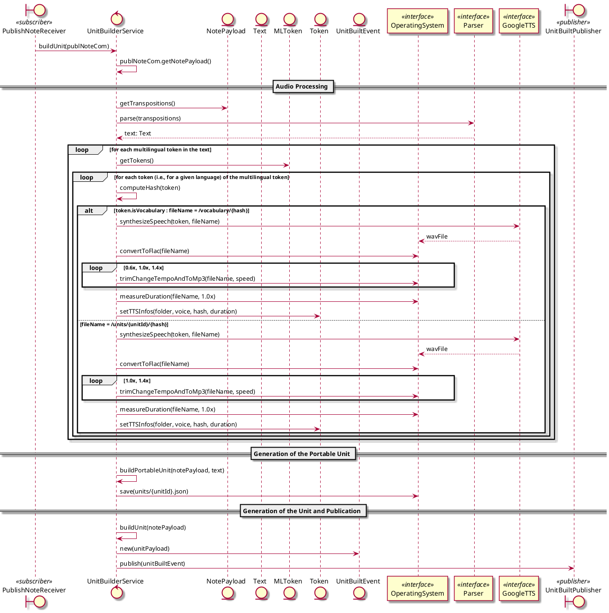

# Building units from notes

A dedicated service builds units from notes.

## Unit building sequence

```plantuml
@startuml
skin rose

boundary PublishNoteReceiver <<subscriber>>
control UnitBuilderService
entity NotePayload
entity Text
entity MLToken
entity Token
entity UnitBuiltEvent
participant OperatingSystem <<interface>>
participant Parser <<interface>>
participant GoogleTTS <<interface>>
boundary UnitBuiltPublisher <<publisher>>

PublishNoteReceiver -> UnitBuilderService : buildUnit(publNoteCom)

UnitBuilderService -> UnitBuilderService : publNoteCom.getNotePayload()

== Audio Processing ==

UnitBuilderService -> NotePayload : getTranspositions()
UnitBuilderService -> Parser : parse(transpositions)
Parser --> UnitBuilderService : text: Text

loop for each multilingual token in the text
  UnitBuilderService -> MLToken : getTokens()
  
  loop for each token (i.e., for a given language) of the multilingual token
      UnitBuilderService -> UnitBuilderService : computeHash(token)
    alt token.isVocabulary : fileName = /vocabulary/{hash}
      UnitBuilderService -> GoogleTTS : synthesizeSpeech(token, fileName)
      GoogleTTS --> OperatingSystem : wavFile
      UnitBuilderService -> OperatingSystem : convertToFlac(fileName)
      loop 0.6x, 1.0x, 1.4x
        UnitBuilderService -> OperatingSystem : trimChangeTempoAndToMp3(fileName, speed)
      end
      UnitBuilderService -> OperatingSystem : measureDuration(fileName, 1.0x)
      UnitBuilderService -> Token : setTTSInfos(folder, voice, hash, duration)
    else fileName = /units/{unitId}/{hash}
      UnitBuilderService -> GoogleTTS : synthesizeSpeech(token, fileName)
      GoogleTTS --> OperatingSystem : wavFile
      UnitBuilderService -> OperatingSystem : convertToFlac(fileName)
      loop 1.0x, 1.4x
        UnitBuilderService -> OperatingSystem : trimChangeTempoAndToMp3(fileName, speed)
      end
      UnitBuilderService -> OperatingSystem : measureDuration(fileName, 1.0x)
      UnitBuilderService -> Token : setTTSInfos(folder, voice, hash, duration)
    end
  end
end

== Generation of the Portable Unit ==

UnitBuilderService -> UnitBuilderService : buildPortableUnit(notePayload, text)
UnitBuilderService -> OperatingSystem : save(units/{unitId}.json)

== Generation of the Unit and Publication ==

UnitBuilderService -> UnitBuilderService : buildUnit(notePayload)
UnitBuilderService -> UnitBuiltEvent : new(unitPayload)
UnitBuilderService -> UnitBuiltPublisher : publish(unitBuiltEvent)

@enduml
```