# Login

## Oveview

```plantuml
@startuml
start

repeat
    : 📝 Login form\n\n(⚠️ Authentication issue)\n(⚠️ Connection issue);
repeat while (authenticated) is (no) not (yes)

if (email validated) then (no)
    if (validation in progress) then (no)
        if (code expired) then (yes)
            : 📝 Validation proposal\n\n⚠️ Code expired;
        else (no)
        endif
        : ⚙️ Send validation email;
    else (yes)
    endif
    repeat
        : 📝 Enter code\n\n(ℹ️ Email sent)\n(⚠️ Incorrect code);
    repeat while (code valid) is (no) not (yes)
    : ⚙️ Save validity;
else (yes)
endif
: Proof of login;
stop
@enduml
```

## Test plan

1. **Login with an account whose email address is not verified**

* A verification email is sent
* A form prompts for code entry and indicates that the email has been sent
* If the code from the email is entered, the email is marked as verified in the database
* The user is redirected to the main menu

🟢 Validated on 08/05/2025

⚠️ Sometimes, when leaving and returning to the app, the state is lost and the user needs to log in again. Considered non-blocking at this stage.

2. **Login with an account whose email is verified**

* The user is redirected to the main menu

🟢 Validated on 08/05/2025

3. **Delayed login during email verification process (code still valid)**

* A verification email is sent
* A form prompts for code entry and indicates that the email has been sent
* The app is closed
* After logging back in, the user is taken directly to the code entry screen
* It is possible to verify the email, same as in case 1

🟢 Validated on 08/07/2025

4. **Delayed login during email verification process (code expired)**

* A verification email is sent
* A form prompts for code entry and indicates that the email has been sent
* The app is closed
* After logging back in, the user is taken to a screen proposing email verification with an explicit message
* A new email is sent
* It is then possible to verify the email as in case 1

🟢 Validated on 08/07/2025

⚠️ Unify the UI appearance
⚠️ Disable buttons during processing to prevent resubmissions
⚠️ Behavior is undefined if the code expires while the user is already on the entry screen
