# Sign up

## Overview

```plantuml
@startuml
start
: 📝 Signup form;
: 📝 Terms and privacy;
while (\nemail or username\n   already taken\n) is (yes)
: 📝 Signup form\n\n(⚠️ Email already taken)\n(⚠️ Username already taken);
endwhile (no)
: ⚙️ Save account\n and acceptance;
: 🔀 Redirect to the\n   login process;
stop
@enduml
```

---

## Test Plan

1. **Create a new account** 🟢

* Terms and conditions must be read and accepted
* Account and acceptance are saved in the database
* Redirection occurs
* Login is possible

2. **Handle conflicts with existing accounts** 🟢

* A specific message appears (email or username already taken)
* Terms and conditions do not need to be accepted again
* Corrections can be made
* Account and acceptance are saved in the database
* Redirection occurs
* Login is possible

3. **No connection** 🟢

* The connection issue is reported
