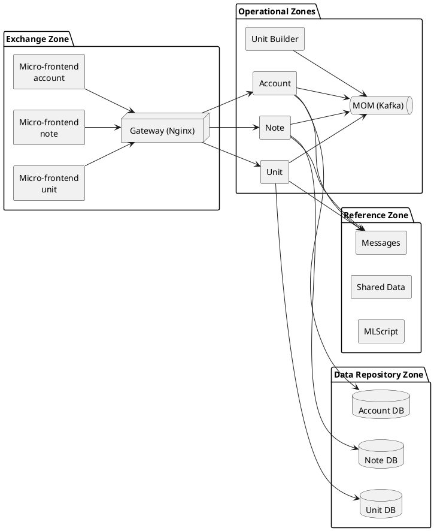
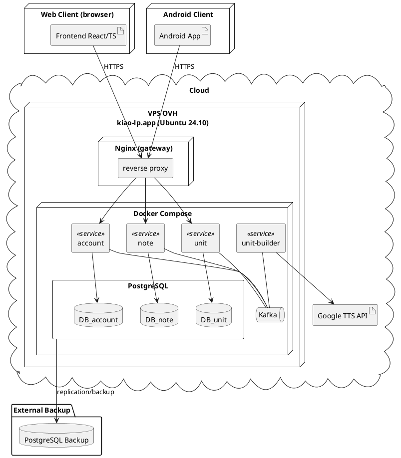
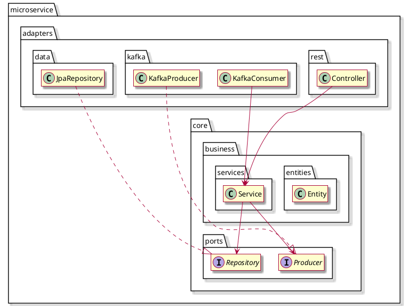

# Global architecture

The goal of this document is to provide a minimalist but up-to-date overview of the architecture of KIAO-Web, the web extension of KIAO.

## 1. Zoning

### 2. Deployment

### 3. Typical service organization

#### Rules

- **adapters are interchangeable** and activated by configuration. For example, a kafka producter can be replaced by a HTTP request sended without impacting the core.
