# Global architecture

The goal of this document is to provide a minimalist but up-to-date overview of the architecture of KIAO.

## 1. Functionnal

## 2. Application

### Role of each zone / group

- **Exchange**: interface with external systems
- **Operation**: manage shared business logic
- **Reference**: standardize and centralize

### Overview

```plantuml
@startuml
skinparam componentStyle rectangle
skinparam defaultTextAlignment center
left to right direction

actor User

package "🌐 Operation" {
    node "Gateway\n(Nginx)" as GW
    
    rectangle "Keycloak" <<managed>> as MSKeycloak
    rectangle "Catalog" <<service>> as MSCatalog

    queue "MOM\n(Kafka)" as MOM

    MSKeycloak --> MOM
    MSCatalog <-- MOM
}

package "🌐 Exchange" {
    component "Catalog components" as CatalogComponents <<library>>
    component "Unit builder" <<service>> as Publication
    component "Go" <<android/web>> as KiaoGO
    component "Notes" <<service/web>> as KiaoNotes

    KiaoNotes --> Publication : REST
    Publication --> GW : REST
    KiaoGO o-- CatalogComponents
    CatalogComponents --> GW : REST
    KiaoGO --> GW : REST
    KiaoNotes --> GW : REST
}

User --> KiaoNotes
User --> KiaoGO

package "🌐 Reference" {
    rectangle "Messages"

    MSKeycloak --> Messages
    MSCatalog --> Messages
}

package "🌐 Data Repository" {
    database "Keycloak DB"
    database "Unit DB"

    MSKeycloak --> "Keycloak DB"
    MSCatalog --> "Unit DB"
}

GW --> MSKeycloak
GW --> MSCatalog
@enduml
```

### Deployment

```plantuml
@startuml
skinparam componentStyle rectangle
skinparam defaultTextAlignment center

left to right direction

node "Desktop" {
  artifact "📦 notes-data-service\n📦 catalog-builder-service\n📦 notes-ui" as KiaoNotes
}

node "KiaoGO" {
  artifact "📦 KiaoMobile" as KiaoMobile
}

cloud "Cloud" {

  ' --- Production Server ---
  node "VPS OVH\nkiao-lp.app (Ubuntu 24.10)" {
    
    node "🐳 Nginx (gateway)" {
      rectangle "reverse proxy" as RP
    }

    node "Docker Compose" {
      component "🐳 k e y c l o a k" <<service>> as registrar
      component "🐳 c a t a l o g" <<service>> as catalog

      component "🐳 PostgreSQL" {
        database "DB_keycloak"
        database "DB_catalog"
      }

      queue "🐳 K a f k a" as Kafka
    }
  }

}

' --- Network Communications ---

KiaoNotes --> RP : HTTPS
"KiaoMobile" --> RP : HTTPS

RP --> "registrar"
RP --> "catalog"

' --- Kafka ---
"registrar" -- "Kafka"
"catalog" -- "Kafka"



' --- Databases ---
"registrar" --> "DB_keycloak"
"catalog" --> "DB_catalog"

@enduml
```

### Typical service organization

