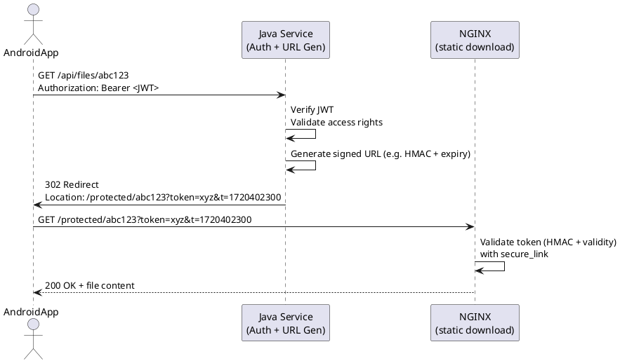

# Downloading the files of a unit

## Target architecture

```plantuml
@startuml
actor AndroidApp
participant "Java Service\n(Auth + URL Gen)" as Java
participant "NGINX\n(static download)" as Nginx

AndroidApp -> Java : GET /api/files/abc123\nAuthorization: Bearer <JWT>
Java -> Java : Verify JWT\nValidate access rights
Java -> Java : Generate signed URL (e.g. HMAC + expiry)
Java -> AndroidApp : 302 Redirect\nLocation: /protected/abc123?token=xyz&t=1720402300

AndroidApp -> Nginx : GET /protected/abc123?token=xyz&t=1720402300
Nginx -> Nginx : Validate token (HMAC + validity)\nwith secure_link
Nginx --> AndroidApp : 200 OK + file content

@enduml
```