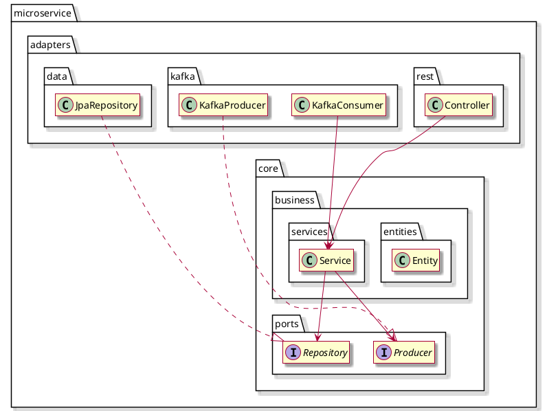
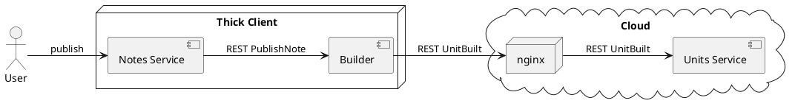
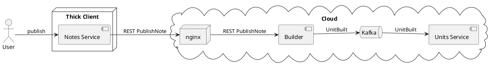

# Rapport d'expérience : architecture hexagonale

## Contexte

Je connais conceptuellement l'architecture hexagonale depuis plusieurs années, mais je ne l'ai jamais vue en pratique. En effet, même si ses principes s'articulent bien avec le Domain Driven Design (en particulier parce qu'elle prône une isolation de la représentation du métier), les cultures et traditions techniques des entreprises soucieuses de concevoir les applications semblent généralement mettre l'accent exclusivement sur DDD.

Alors, comme la formation que je suis hors temps de travail au CNAM (GLG204) proposait son utilisation, j'ai imaginé une organisation des microservices de KIAO basée sur l'architecture hexagonale. Après avoir donné quelques informations sur ce qu'elle est, et expliqué comment je l'ai appliquée, je vais vous parler des résultats que j'ai obtenus.

## L'architecture hexagonale

On peut résumer simplement l’idée de l’architecture hexagonale ainsi :
il s’agit de diviser le système en deux parties :

- Un noyau, qui implémente la logique métier.

- Des composants qui connectent ce noyau à l’environnement externe du système. Ces composants sont appelés adaptateurs.

Les adaptateurs étant modulaires et interchangeables, ils sont moins génériques que le noyau, qui ne doit pas y accéder directement. C'est pour ça le noyau définit des représentations abstraites appelées "ports", que les adaptateurs implémentent. L'injection de dépendances fait le lien.

## Application de l'architecture hexagonale à un service Spring/JPA/Kafka

Dans les services de Kiao, on retrouve des concepts de conception issus de :
- JPA (entités / dépôts)
- Kafka (producteurs, consommateurs)
- L'organisation typique des services Spring (contrôleurs)

Je voulais les structurer selon l'architecture hexagonale.

Pour répondre à toutes ces contraintes, j'ai abouti à l’organisation suivante :



## Résultats

Tout d’abord, cette organisation a très bien résisté lors de la phase de mise en œuvre et a pu être mise en production sans nécessiter de corrections majeures. En résumé : ça fonctionne très bien !

Voici quelques constats intéressants.

#### Interchangeabilité des adapteurs

Ce que j'ai remarqué rapidement, c'est que pourvoir remplacer les adapateurs par d'autres sans impacter la logique métier (qui correspond à 90% du code) était particulièrement utile dans mon cas.

Je vous explique :

L'un de mes services, « unit-builder », consomme beaucoup de ressources : pour une grande quantité de petits textes (phrases, mots de vocabulaire), il interagit avec Google TTS pour générer des enregistrements audio, il supprime les silences, modifie la vitesse, et encode le résultat en mp3. [Plus de détails ici](../architecture/building-units-from-notes.html)


Comme Kiao est un projet non commercial, il est important d’en minimiser les coûts d’exploitation et dans un premier temps seul un petit nombre de personnes seront habilitées à publier des unités. Cela dit, cela ne doit pas empêcher une évolution future vers un autre modèle permettant une diffusion plus large de la fonctionnalité « génération d’unités ». À court terme, elle sera donc proposée dans une application de bureau (V1). Mais à l’avenir, elle pourrait être disponible depuis le cloud.

Or, dans mon architecture cloud, je privilégie l'intégration des services par le biais de Kafka (tolérance aux indisponibilités, résistance aux pics de charge, etc.), alors que j’aimerais éviter d'une part de l'embarquer dans l'application de bureau, et d'autre part d'ouvrir un accès à l'instance de Kafka qui s'exécute sur le cloud. En bref la logique métier est la même, mais pas la façon dont les services communiquent.

Voici les deux configurations que je viens d'évoquer :

##### Génération d’unités dans l'application de bureau (V1)



##### Génération d’unités dans l'application de bureau (V2)



En réalité beaucoup plus tard, le client lourd, basé sur des technologies WEB, est également destiné à être déplacé sur le cloud : c'est une V3 non décrite ici.

Pour s'adapter à ces configurations techniques, le choix de l'architecture hexagonale est un avantage de taille, puisque la séparation nette des adaptateurs (variables selon l'environnement), et du coeur (protégé de variations externes), minimise le code différent dans chacun des cas. Ainsi, je sélectionne l'adaptateur Kafka, l'adaptateur REST ou même les deux par simple configuration :

```yaml
kiao:
  unit-builder:
    ports:
      unit-built-publisher:
        adapters:
          kafka: false
          rest: true
        rest:
          url: https://www.kiao-lp.app/api/units/unit-built
          apiKey: MY_API_KEY_IS_SECRET_DONT_EXPECT_IT_HERE
```

Pratique, non ?

#### Une organisation atypique

On remarque également que cette organisation peut surprendre les développeurs non familiarisés. Il faut comprendre les frontières entre le noyau et les adaptateurs pour pouvoir la préserver. Cependant, une fois que l’on s’y est habitué, on en apprécie la profondeur et l’intuitivité.

## Conclusion

S'inspirer de l'architecture hexagonale pour organiser un microservice est facile et globalement avantageux. On oublie rapidement le petit ticket d'entrée pour maîtriser/expliquer les concepts sous-jacents quand on retrouve facilement ce que l'on cherche. Par delà ce petit avantage, dès lors qu'une flexibilité en terme d'échanges est nécessaire, l'approche hexagonale prend vraiment tout son sens.
