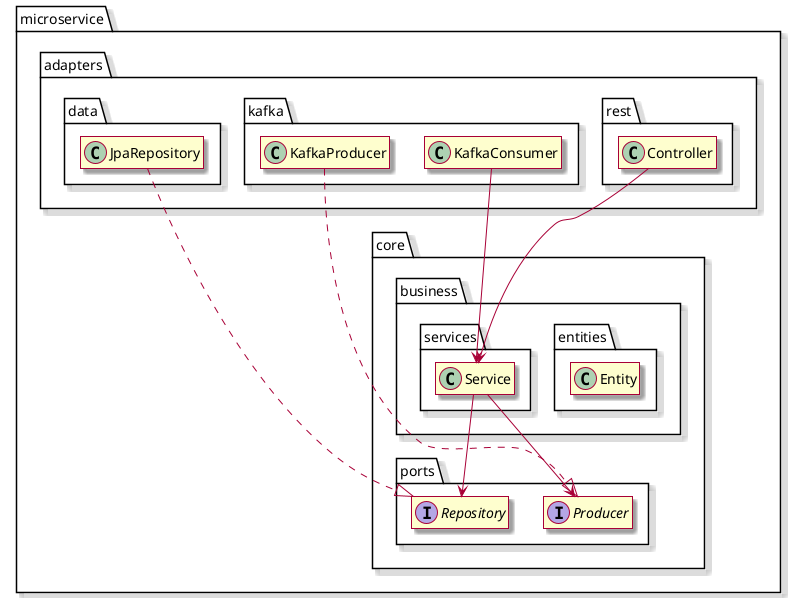
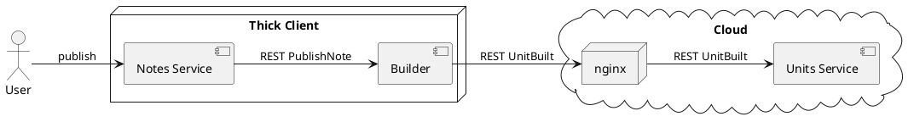
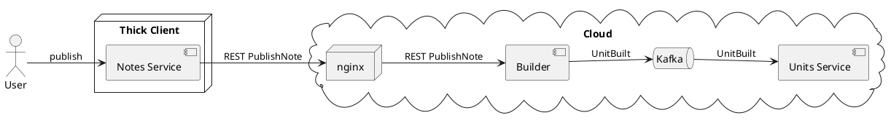

# Experience Report: Hexagonal Architecture

## Context

I’ve known about hexagonal architecture conceptually for several years, but I had never seen it applied in practice. While its principles align well with Domain-Driven Design (especially since it promotes isolating business logic from representation), companies that focus on designing applications typically emphasize DDD exclusively.

So, when the course I’m taking outside of work at CNAM (GLG204) introduced its use, I envisioned organizing KIAO’s microservices based on hexagonal architecture. After providing a quick explanation of what it is and how I applied it, I’ll share the results I obtained.

## Hexagonal Architecture

The idea of hexagonal architecture can be summarized simply:
It involves dividing the system into two parts:

* A **core**, which implements the business logic.
* Components that connect this core to the external environment. These components are called **adapters**.

Since adapters are modular and interchangeable, they are less generic than the core, which must not access them directly. That’s why the core defines abstract representations called **ports**, which the adapters implement. Dependency injection links everything together.

## Applying Hexagonal Architecture to a Spring/JPA/Kafka Service

KIAO’s services include design concepts from:

* JPA (entities/repositories)
* Kafka (producers, consumers)
* Typical Spring service structure (controllers)

I wanted to structure them according to hexagonal architecture.

To accommodate all these constraints, I arrived at the following organization:



## Results

First of all, this structure held up very well during implementation and was successfully deployed to production without requiring major adjustments. In short: it works very well!

Here are some interesting observations:

### Adapter Interchangeability

What I noticed quickly was that being able to replace adapters without affecting the business logic (which accounts for 90% of the code) was particularly useful in my case.

Let me explain:

One of my services, **"unit-builder"**, is resource-intensive: for a large volume of small texts (phrases, vocabulary words), it interacts with Google TTS to generate audio recordings, removes silences, adjusts speed, and encodes the result to mp3. [More details here](../architecture/building-units-from-notes.html)

Since KIAO is a non-commercial project, it’s important to keep operating costs low, and initially, only a small group of users will be allowed to publish units. That said, this shouldn’t prevent a future evolution toward a broader release of the “unit generation” feature. In the short term, it will be offered through a desktop application (V1), but eventually it may be moved to the cloud.

Now, in my cloud architecture, I prefer integrating services through Kafka (for fault tolerance, resilience to load spikes, etc.), while I’d like to avoid embedding Kafka in the desktop app or exposing the cloud Kafka instance. In short, the business logic is the same, but the communication methods differ.

Here are the two configurations I just mentioned:

#### Unit Generation in the Desktop Application (V1)



#### Unit Generation in the Cloud (V2)



In fact, much later, the thick client (based on web technologies) is also planned to be moved to the cloud — this is a V3, which is not described here.

To adapt to these technical configurations, hexagonal architecture is a huge advantage, since the clear separation between adapters (which vary by environment) and the core (shielded from external changes) minimizes the amount of differing code in each case. Thus, I can select the Kafka adapter, the REST adapter, or both through a simple configuration:

```yaml
kiao:
  unit-builder:
    ports:
      unit-built-publisher:
        adapters:
          kafka: false
          rest: true
        rest:
          url: https://www.kiao-lp.app/api/units/unit-built
          apiKey: MY_API_KEY_IS_SECRET_DONT_EXPECT_IT_HERE
```

Convenient, right?

### An Unusual Structure

This structure can also be surprising for developers unfamiliar with it. One must understand the boundaries between the core and the adapters to preserve them. However, once you get used to it, you come to appreciate its depth and intuitiveness.

## Conclusion

Using hexagonal architecture as inspiration for structuring a microservice is easy and generally beneficial. The small initial learning curve to understand and explain the underlying concepts is quickly forgotten when you can easily find what you're looking for. Beyond this convenience, as soon as communication flexibility is needed, the hexagonal approach truly shines.