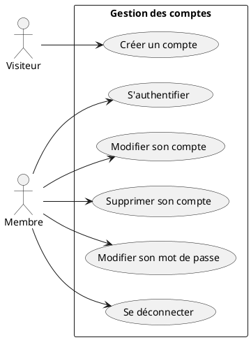
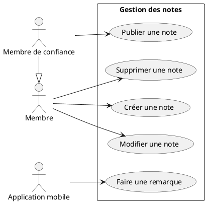
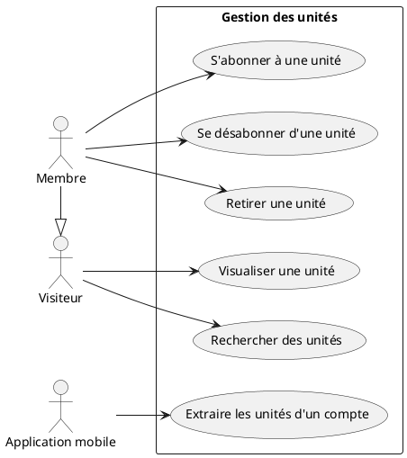

# Expression des besoins

## But et contexte

Le but du projet est de doter **KIAO** (Knowledge Information And Operations) d'une infrastructure de distribution et d'interraction entre utilisateurs.

KIAO contient :

- un **logiciel de prise de notes** (dans un format inspiré de markdown)
- une **application android** interprétant ces notes sous formes d'exercices.

Ces composants existent déjà, mais doivent être remaniés. (Ce n'est pas de leur développement qu'il est question ici, mais de celui de l'infrastructure qui permet de les rendre utilisables par la communauté.)

Pour que cela fonctionne les notes contiennent :

- des indices (questions ou débuts de phrase)
- des réponses attendues

**Exemple** :

```
?Quels sont les buts de l'expression des besoins ?
- délimiter le système
- définir les fonctionnalités du point de vue utilisateur
```

Le texte ci-dessous génère (Text To Speech) le discours suivant :

*Complétez : Quels sont les buts de l'expression des besoins ?*

*[temps d'attente]*

*délimiter le système*

*[temps d'attente]*

*définir les fonctionnalités du point de vue utilisateur*

A tout moment l'utilisateur peut enregistrer un échec, ou indiquer que la question est trop facile (s'il n'indique rien il s'agit d'une réussite), et l'ensemble des résultats successifs déterminera le moment de la prochaine tentative (apprentissage distribué).

En cas d'échec, le système dira :

*Répétez : Quels sont les buts de l'expression des besoins ?*
- *délimiter le système*
- *définir les fonctionnalités du point de vue utilisateur*

*[temps d'attente]*

Dans tous les cas, l'exercice suivant sera alors lancé.

En réalité, il existe plusieurs exercices sur le même principe : vocabulaire dans plusieurs langues, apprentissage de phrases importantes, exercices écrits (de mathématiques, par exemple). Les exercices sont toujours définis dans le texte des notes.

Chaque [type d'exercices](https://github.com/ezwn/kiao-pub/blob/main/infra/maven/kiao-knowledge-assessment-lib/src/main/java/kiao/knowledge/assessment/ExerciseType.java) a ses propres paramètres de planification (période réfractaire minimale, exposant d'apprentissage, exposant d'oubli, etc.) qui influencent le [calcul de la durée de consolidation](https://github.com/ezwn/kiao-pub/blob/563012c70474bf51d323922e802d69e100cee968/infra/maven/kiao-knowledge-assessment-lib/src/main/java/kiao/knowledge/assessment/AttemptLog.java#L46) pendant laquel l'exercice est supposé stable en mémoire.

Note : le contenu textuel des notes/unités, sur lequel est fondé les exercices n'est analysé que :

1. dans le cadre du champ de saisi (pure frontend)
2. dans l'application déployée sur téléphone mobile

Cela ne fait donc pas partie de ce projet. Toutefois le code source de l'analyseur est disponible ici :

https://github.com/ezwn/kiao-pub/tree/main/infra/maven/kiao-mlscript-lib

## Acteurs

- visiteur : acteur non authentifié
- membre
- membre de confiance : peu déclencher des actions coûteuses en ressources
- administrateur
- application mobile : acteur non humain car elle ne fait pas partie des interactions et que sa modélisaiton interne serait beaucoup trop complexe dans le cadre de cet exercice.

## Règles générales

### Validation des données

Sauf mention contraire :

- Toutes les zones de saisie (formulaires) valident les entrées utilisateur en temps réel et le bouton qui finalise la saisie (bouton de soumission) n'est actif que lorsque les informations sont valides. Des messages mis à jour au fur et à mesure de la saisie indiquent à l'utilisateur quels sont les problèmes d'intégrité.

- Lorsque la finalisation a été demandée, le système vérifie, en interne, une seconde fois la validité des informations saisies. En cas d'échec, un message générique est affiché à l'utilisateur et le cas d'utilisation est interrompu.

## Cas d'utilisation

### Groupe "Comptes"



#### Créer un compte

##### Résumé

N'importe quel visiteur non authentifié peut créer un compte.

##### Acteur

- Visiteur

##### Pré-conditions

- Ne pas être authentifié.

##### Contraintes de déploiement

- Disponible par internet.

##### Scénario nominal

1. le visiteur active l'option "inscription" sur l'une des pages.
2. le système présente un formulaire (langue principale, email, nom public et mot de passe avec confirmation).
3. le visiteur renseigne le formulaire (validation/activation de soumission en temps réel).
4. le système vérifie l'unicité du nom public et crée un compte inactif de type "membre".
5. le système envoie un message de création pour la note racine de l'utilisateur au système "notes" qui crée la note avec le texte "Bienvenue chez vous !" dans la langue du formulaire.
7. le système envoie un lien avec code d'activation à l'adresse email.
8. le visiteur utilise le lien.
9. le système active le compte.

##### Scénario d'erreur : nom public déjà utilisé

Si, en 4, le nom public est déjà utilisé, le visiteur est redirigé vers le formulaire (3.) et un message lui indique que le nom d'utilisateur est utilisé par un autre membre.

##### Post-conditions

Le visiteur dispose d'un compte "membre" actif.

##### Contraintes non fonctionnelles

Aucune.

#### Modifier son mot de passe

##### Résumé

Il s'agit pour un membre ne pouvant plus se connecter de modifier son mot de passe.

##### Acteur

- Visiteur

##### Pré-conditions

- Posséder un compte.

##### Contraintes de déploiement

- Disponible par internet.

##### Scénario nominal

1. le visiteur active l'option "modifier mon mot de passe" sur le formulaire de login.
2. le système demande l'email.
3. le visiteur saisi l'email et valide (impossible de valider si l'email est mal structuré).
4. le système envoi un email avec un lien temporaire et l'indique au visiteur.
5. le visiteur suit le lien.
6. le système affiche un formulaire (mot de passe et confirmation).
7. le visiteur renseigne le mot de passe (et confirme) et valide.
8. le système met à jour le mot de passe et redirige vers la page de login.

##### Scénario d'erreur : email inconnu

Si, en 4, l'adresse email n'est pas connue, aucun email n'est envoyé. Cependant le problème n'est pas rapporté à l'utilisateur.

##### Post-conditions

Le mot de passe associé au compte est mis à jour.

##### Contraintes non fonctionnelles

Aucune.

#### S'authentifier

##### Résumé

Permet de se connecter à l'application.

##### Acteur

- Visiteur
- Application mobile

##### Pré-conditions

- Ne pas déjà être authentifié.

##### Contraintes de déploiement

- Disponible par internet.

##### Scénario nominal

1. le visiteur saisi son email, mot de passe et valide. (envoi de ces informations via API dans le cas de l'application mobile)
2. le système lui fournit un token JWT.

##### Scénario alternatif : informations incorrectes

Embranchement en 2, si les informations sont incorrectes.

1. Le système enregistre l'échec et le visiteur/application peut re-tenter.

##### Post-conditions

Le visiteur/l'applicatiob mobile dispose d'un token JWT.

##### Contraintes non fonctionnelles

Pas de transfer en clair du mot de passe ou du token sur Internet.

#### Se déconnecter

##### Résumé

Permet de se déconnecter de l'application.

##### Acteur

- Membre
- Application mobile

##### Pré-conditions

- Être authentifié.

##### Contraintes de déploiement

- Disponible par internet.

##### Scénario nominal

1. le membre clique sur le lien de déconnexion.
2. le système révoque le token JWT.
3. le membre est redirigé vers la page d'accueil.

##### Post-conditions

La preuve d'identité est révoquée.

#### Modifier son compte

##### Résumé

Un membre peut modifier les informations concernant son compte.

##### Acteurs

- Le membre.

##### Pré-conditions

- Posséder un compte et être authentifié.

##### Scénario nominal

1. Le membre active l'option menant à son compte.
2. le système présente un formulaire (email, nom public et mot de passe avec confirmation).
3. le visiteur renseigne le formulaire.
4. quand les informations sont valides, le bouton d'envoi s'active.
5. le visiteur utilise ce bouton.
6. le système vérifie l'unicité du nom public, met à jour le compte puis redirige vers l'accueil.

##### Scénario d'erreur : nom public déjà utilisé

Si, en 6, le nom public est déjà utilisé, le visiteur est redirigé vers le formulaire (4.) et un message lui indique que le nom d'utilisateur est utilisé par un autre membre.

#### Supprimer son compte

##### Acteurs

- Membre

##### Pré-conditions

- Posséder un compte et être authentifié.

##### Scénario nominal

1. Le membre active l'option menant à son profil, puis celle de suppression du compte.
3. le système demande confirmation.
4. le membre confirme.
5. le système supprime le compte.
6. le membre est redirigé sur l'accueil.
### Groupe "Notes"

Les notes doivent être comprises dans le sens de "prise de notes". L'essentiel d'une note est donc son contenu (texte).



#### Créer une note fille

On rappelle que la note "racine" est crée avec le compte. Il s'agit, pour un utilisateur donné de la seule note sans parent et elle ne peut pas être supprimée.

##### Résumé

Un membre crée une nouvelle note qui ne contient pas encore de texte.

##### Acteur

Le membre.

##### Pré-conditions

Être en train d'éditer le texte d'une note, c'est à dire avoir positionné le curseur à l'intérieur du champs de saisie de celui-ci.

##### Scénario nominal

1. le membre sélectionne l'option d'ajout de note.
2. le système demande la langue (valeur par défaut héritée de la note parente) et le titre.
3. l'utilisateur ajuste les valeurs évoquées ci-dessus et finalise.
4. le système génère un ID pour la note fille, la crée, insère un lien vers la note fille dans la note parente et met à jour la note parente.

##### Post-conditions

- une nouvelle note est créée.
- la note parente contient un lien vers la nouvelle note.

#### Modifier une note

##### Résumé

Modification d'une note existante.

##### Acteur

- Membre

##### Pré-conditions

Aucune.

##### Scénario nominal

1. Le membre navigue jusqu'à la note qu'il souhaite modifier.
2. Lorsqu'il est sur la page d'édition...

- Il voit :
  - Le formulaire d'édition (ci-dessous).
  - L'aperçu de la note.

- Il peut modifier :
  - le domaine associé à la note.
  - les langues disponibles.
  - pour chaque langue: le titre, le résumé et le contenu (texte).
  - les tags.
  - les commentaires privées (texte ne faisant pas partie du contenu des notes)

Exception par rapport au comportement général des formulaires : le bouton de finalisation est toujours activé.

3. le membre demande la finalisation.
4. le système sauvegarde la note (pas validation à ce stade).

##### Contraintes non fonctionnelles

Aucune.

##### Post-conditions

La note est mise à jour.

#### Supprimer une note

##### Résumé

Suppression d'une note existante.

##### Acteurs

- Membre

##### Pré-conditions

Aucune.

##### Scénario nominal

1. le membre édite la note qu'il souhaite supprimer et ce n'est pas sa note racine.
2. dans la section "configuration" il active l'option "supprimer".
4. le système demande confirmation.
5. si confirmation, suppression de la note et redirection vers la note parente.

##### Scénario alternatif

En 4., si l'utilisateur renonce le scénario s'arrête.

##### Post-conditions

- la note est supprimée.

#### Publier une note

##### Résumé

C'est l'action par laquelle le membre partage sa note avec la communauté, sous la forme d'une unité d'apprentissage.

##### Pré-conditions

Aucune : la re-publication, même si la note n'a pas changé, peut avoir un intérêt quand les voix sont améliorées au niveau du text to speach et est donc toujours possible si la note est valide (voir ci-dessous).

##### Acteur

- Membre de confiance

##### Contraintes non-fonctionnelles et de déploiement

Les traitements audio sont effectués de manière asynchrone, dans le cloud. Le gain en coût d’un traitement hors cloud ayant été jugé marginal, cette option a été écartée.

##### Scénario nominal

1. le membre de confiance édite la note qu'il souhaite publier.
2. il se dirige vers la section "configuration" et active l'option "publier".
3. le système vérifie que la note est prête à être publiée :
 - elle doit contenir, pour chaque langue, un titre, une description et un contenu.
 - un domaine doit être sélectionné.
 - le contenu textuel doit être valide.
4. le système demande confirmation.
5. le membre de confiance confirme.
6. le systme indique à l'utilisateur que la publication est prise en compte
7. la note est transformée en unité (et écrase l'unité pré-existante) :
- d'une part en transcrivant les données (note vers unité) et en sauvegardant l'unité résultante.

En réalité note et unité ont des structures très proches :

Une note est composée de "transpositions" (propriétés : langues, titre, texte, ...)
Une unité contient des "pistes" (propriétés identiques à transposition)

Les deux contiennent également un domaine et des tags.

Les informations privées (commentaire, par exemple) ne sont pas copiées, et certaine transposition peuvent ne pas être exportées vers des pistes grâce à un champ qui active l'export ou pas.

Cette transcription est donc presque une copie.

L'unité est horodatée et sauvegardée (écrasée si existante).

- d'autre part en récupérant les fichiers audios nécessaires (TTS), en les traitant, et en les mettant à disposition sur le système de fichier. 

8. la date de pulication de la note est mise à jour à partir de celle de l'unité (identiques).

9. la note est sauvegardée.

10. un email est envoyé à l'auteur de la note pour lui signaler que sa note est publiée

##### Scénarios alternatifs

###### Problème de validation

En 3., si la note n'est pas valide un message indique qu'il n'est pas possible de plublier une note invalide. Il n'est pas nécessaire de préciser la raison exacte car ce feedback est permanent.

###### Renonciation

En 4., si l'utilisateur renonce, le scénario nominal s'arrête.

###### Renonciation

En 7., en cas d'erreur technique lors de la génération de l'unité, un email est envoyé à l'utilisateur pour lui demander de réessayer plus tard.

##### Post-conditions

- Les fichiers audios sont disponibles sur internet.
- L'unité est créée ou mise à jour.
- La note est mise à jour.

#### Faire une remarque

##### Résumé

Durant les exercices, les membres qui utilisent l'application mobile peuvent détecter des problèmes et souhaiter les signaler par le biais d'une remarque. Dans la mesure où l'application mobile ne fait pas partie du système, c'est elle, l'acteur qui émet la remarque de l'utilisateur.

##### Acteurs

- Application mobile.

##### Contraintes de déploiement

L'application mobile dialogue avec le système "notes" via Internet.

##### Pré-conditions

L'application a un token JWT arpès s'être authentifiée (même API que login web).

##### Scénario nominal

1. l'application mobile envoie les informations d'authentification dans une requête contenant :
- le token JWT
- l'ID de l'unité
- l'ID de l'exercice
- le contenu de la remarque

2a. le système informe l'application que la requête a été prise en compte.

2b. le système ajoute la remarque aux notes de façon asychrone non prioritaire.

3. un email est envoyé à l'auteur de la note avec un lien vers celle-ci.

##### Scénario alternatif : informations incorrectes

Embranchement en 2, si les informations d'authentification sont incorrectes.

1. Le système enregistre l'échec.

2. Le système renvoi un code d'erreur non spécifique.

##### Contraintes non fonctionnelles

- les données d'authentification sont chiffrées.

##### Post-conditions

La note est enrichie de la remarque.

##### Questions en suspend

L'application mobile ne dispose pas de référence vers la note, mais uniquement vers l'unité qui en est produite. Une projection des données sera donc nécessaire.

### Groupe "Unités"

Les unités doivent être comprises dans le sens de "unité d'apprentissage", c'est à dire un ensemble contenant un cours, et éventuellement des exercices. Elles sont construites à partir de notes, durant leur publication.



#### Retirer une unité

##### Pré-conditions

Le membre est l'auteur de l'unité.

##### Résumé

C'est l'opération inverse de la publication.

##### Scénario nominal

1. Le membre visualise l'unité qu'il souhaite retirer.
2. En temps qu'auteur, il dispose d'une option "supprimer", qu'il active.
3. Le système demande confirmation.
4. L'unité est supprimée.

#### Rechercher des unités

##### Résumé

Il s'agit de lister les unités qui contiennent certains mots.

##### Acteur

N'importe quel visiteur.

##### Contraintes de déploiement

La fonctionnalité est disponible par Internet.

##### Pré-conditions

Aucune.

##### Scénario nominal

1. le visiteur saisi des mots dans la barre de recherche et valide.

2. le système recherche les unités contenant tous les mots clés (dans : titres, descriptions, tags et nom de l'auteur) et affiche la liste des 20 premières. Pour chaque unité on peut voir :

- son titre
- sa description
- ses tags
- ses langues
- le nom de l'auteur
- le nombre d'abonnés

##### Scénario alternatif : pas de résultats

Embranchement en 2, s'il n'y a pas de résultats :

Le système affiche une page indiquant qu'il n'y pas de résultat et suggère de supprimer des mots de filtrage.

##### Post-conditions

Le cas d'utilisation n'induit pas de changement.

#### Visualiser une unité

##### Pré-conditions

Aucune.

##### Scénario nominal

1. le visiteur accède à une unité (par exemple après une recherche).

2. le système affiche :

Le chemin de domaines de l'unité (Sciences Humaines > Management > Théorie des organisations)

A propos :
- titre
- description
- le nombre d'abonnés
- les langues prises en charge
- l'auteur

Avis:
- liste des avis avec notes

Aperçu du contenu

Des options contextuelles :
- s'abonner / se désabonner
- retirer l'unité
- donner son avis

#### S'abonner à une unité

##### Résumé

Le membre peut s'abonner à une unité, ce qui (indirectement) la rend disponible sur son téléphone mobile pour apprentissage.

##### Acteurs

- Membre

##### Pré-conditions

Ne pas être abonné à l'unité.

##### Contraintes de déploiement

La fonctionnalité est disponible par Internet.

##### Scénario nominal

1. Depuis la page de visualisation de l'unité, le membre active l'option "abonnement".

2. Le système sauvegarde le fait que le membre est abonné à l'unité.

3. L'option "abonnement" est remplacée par l'option "désabonnement".

##### Post-conditions

Le membre est abonné à l'unité.

##### Contraintes non fonctionnelles

Aucune.

#### Se désabonner d'une unité

##### Résumé

Le membre peut se désabonner d'une unité, ce qui (indirectement) la fait disparaître de son téléphone mobile.

##### Acteurs

- Membre

##### Contraintes de déploiement

La fonctionnalité est disponible par Internet.

##### Pré-conditions

Être abonné à l'unité.

##### Scénario nominal

1. Depuis la page de visualisation de l'unité, le membre active l'option "désabonnement".

2. Le système enregistre ce choix.

3. L'option de désabonnement est remplacée par l'option d'abonnement.

##### Post-conditions

Le membre n'est plus abonné à l'unité.

##### Contraintes non fonctionnelles

Aucune.

#### Extraire les unités d'un compte

##### Résumé

Ce cas d'utilisation permet à l'application mobile de connaître la liste des unités auxquelles est abonné son utilisateur. L'application mobile ne fait pas partie du système étudié dans ce document, c'est donc un acteur.

##### Acteurs

L'application mobile.

##### Contraintes de déploiement

L'application mobile interroge le système "unités" via Internet.

##### Pré-conditions

L'application a un token JWT arpès s'être authentifiée (même API que login web).

##### Scénario nominal

1. l'application mobile demande la liste des unités pour son utilisateur.

2. le système lui envoie la liste.

##### Scénario alternatif : informations incorrectes

Embranchement en 2, si les informations sont incorrectes.

1. Le système enregistre l'échec. Si l'email existe, l'échec est associé au compte.

2. Le système renvoi un code d'erreur non spécifique.

##### Contraintes non fonctionnelles

- les données d'authentification sont chiffrées.

##### Post-conditions

L'application mobile dispose de la liste d'unités mise à jour pour son utilisateur.
