# Analyse

## Objectifs du document

Ce document présente la démarche qui a permi de prioriser les cas d'utilisations, analyse les plus importants d'entre eux et effectue une synthèse sous la forme d'un diagramme de classes consolidé.

## Aperçu des cas d'utilisation

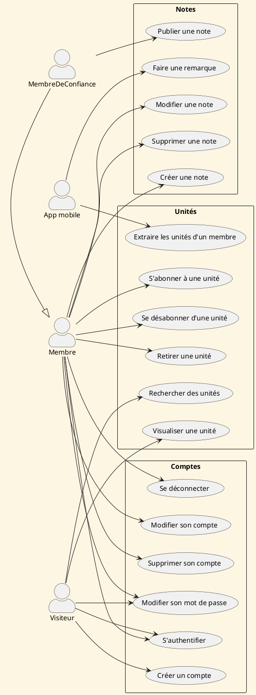

## Priorité à analyser les cas d'utilisation

| Nom                                 | Pertinence | Risque | Priorité | Justification                                                                  |
| ----------------------------------- | ---------- | ------ | -------- | ------------------------------------------------------------------------------ |
| **Créer un compte**                 | 5          | 2      | 1        | Point d’entrée indispensable, implique validation et génération de note racine |
| **S'authentifier**                  | 5          | 2      | 1        | Base de sécurité, point de passage pour tout utilisateur                       |
| **Publier une note**                | 5          | 3      | 1        | Central dans le modèle KIAO, à fort impact métier et technique (TTS, export…)  |
| **Extraire les unités d'un compte** | 5          | 2      | 1        | Pont entre back-end et mobile, à clarifier tôt dans la conception              |
| **Faire une remarque**              | 4          | 2      | 2        | UX critique pour feedback qualité, usage mobile important                      |
| **Visualiser une unité**            | 4          | 1      | 2        | Usage courant, essentiel pour s’abonner ou consulter                           |
| **Rechercher des unités**           | 4          | 2      | 2        | UX fluide, moteur de découverte, dépend des métadonnées                        |
| **S'abonner à une unité**           | 4          | 1      | 3        | Important mais plus simple techniquement                                       |
| **Se désabonner d'une unité**       | 4          | 1      | 3        | Idem, même logique                                                             |
| **Créer une note**                  | 3          | 2      | 3        | Intéressant mais moins critique tant que l’éditeur est en place                |
| **Modifier une note**               | 3          | 3      | 2        | Complexité UI et métier (langues, balises, etc.) à analyser tôt                |
| **Retirer une unité**               | 3          | 2      | 3        | Nécessite vérification d’autorisations, mais usage moins fréquent              |
| **Modifier son mot de passe**       | 3          | 1      | 4        | Standard                                                                       |
| **Se déconnecter**                  | 3          | 1      | 4        | UX standard mais faible risque                                                 |
| **Modifier son compte**             | 2          | 1      | 5        | Peu fréquent, UX basique                                                       |
| **Supprimer une note**              | 2          | 1      | 5        | Rare, mais nécessite vérification liée à note racine                           |
| **Supprimer son compte**            | 2          | 2      | 5        | Rare, avec implications légales (RGPD), mais simple à implémenter              |

## Analyse des cas d'utilisation

### Créer un compte

#### Liste des objets candidats

À partir du scénario, on identifie les éléments suivants :

- le **visiteur**
- le **formulaire d’inscription**
- le **compte** (email, nom public, mot de passe, actif/inactif …)
- un **code d’activation**
- un **lien envoyé par mail**
- une **note racine** contenant "Bienvenue chez vous !"
- une **commande de création de note**
- un **service de messagerie**

On peut extraire les objets suivants :

- `Visiteur` (acteur)
- `FormulaireInscriptionUI` (boundary)
- `InscriptionWorkflow` (control)
- `Compte` (entité)
- `Note` (entité, utilisée pour la note racine)
- `CommandeCreationNote` (Value Object)
- `ServiceMail` (système extérieur)
- `CompteLocator` (lifecycle)

#### Diagramme de séquence – scénario nominal

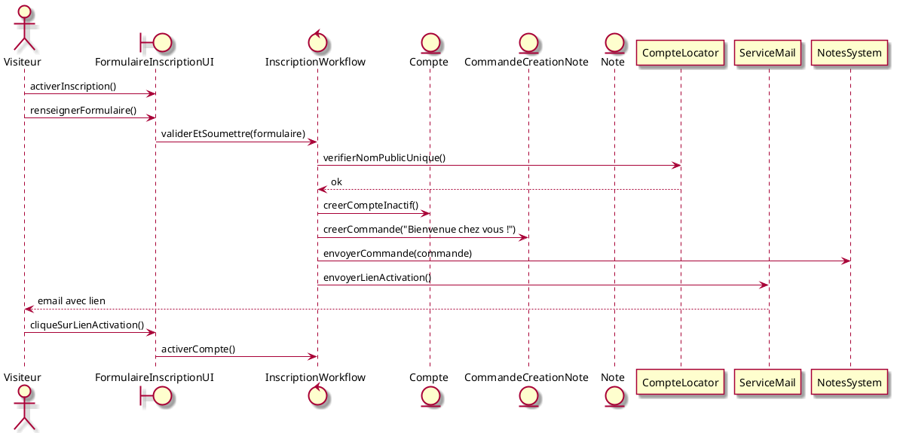

#### Diagramme de classe consolidé

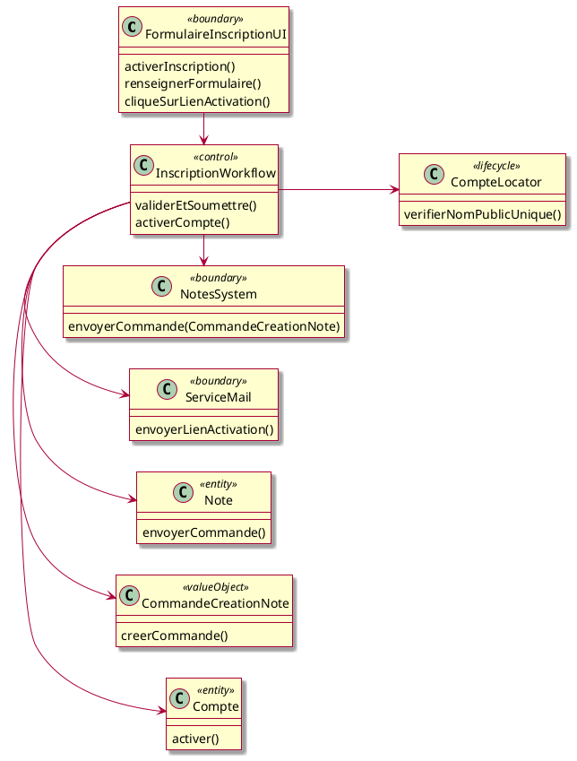

#### Remarques

- On suppose ici que `CommandeCreationNote` est un *Value Object* qui encapsule la requête de création initiale de note.
- Le lien envoyé par mail contient un **token d’activation** stocké dans le compte.
- `Note` n’est pas créée par l’acteur, mais par effet de bord métier, ce qui justifie sa présence dans ce use case.

### S'authentifier

#### Liste des objets candidats

À partir du scénario, on identifie les objets suivants :

- `Visiteur` (acteur)
- `LoginUI` (boundary) – interface de saisie de l’email et du mot de passe
- `LoginWorkflow` (control) – logique de validation
- `Compte` (entity) – utilisateur identifié
- `CompteLocator` (lifecycle) – accès aux données des comptes

#### Diagramme de séquence – scénario nominal

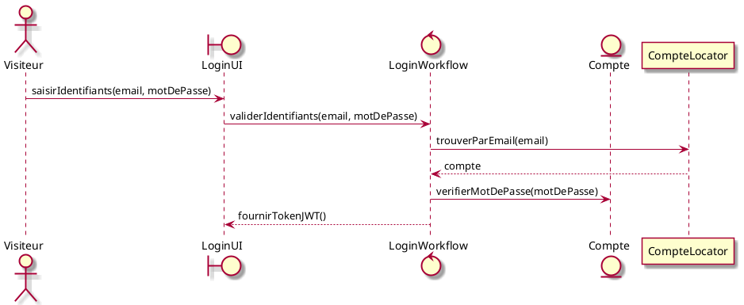

#### Diagramme de séquence – scénario alternatif : mot de passe incorrect

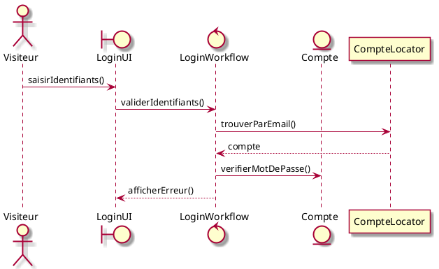

#### Diagramme de séquence – scénario alternatif : email inconnu

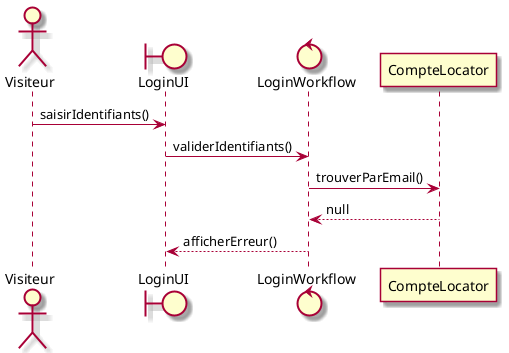

#### Diagramme de classes consolidé pour le use case

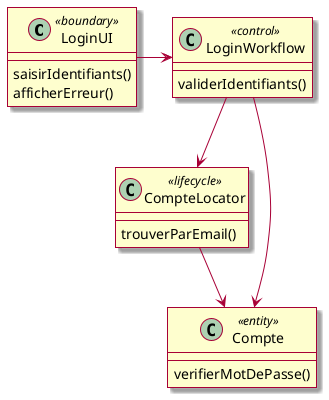

### Publier une note

#### Liste des objets candidats

À partir du scénario nominal, on identifie les éléments suivants :

- le **membre de confiance** (acteur)
- une **note** éditée
- une **unité** résultant de la publication
- des **transpositions** de la note (titre, description, texte, voix…)
- des **pistes** de l’unité (copie transformée des transpositions)
- les **métadonnées** (domaine, tags…)
- un **workflow de publication**
- une **interface de publication**
- une **date de publication**
- un **système de notification**

D’où la liste suivante d’objets candidats :

- `MembreDeConfiance` (acteur)
- `Note` (entité)
- `Unité` (entité)
- `Transposition` (entité ou sous-partie de Note)
- `Piste` (entité ou sous-partie de Unité)
- `PublicationUI` (boundary)
- `PublicationWorkflow` (control)
- `NotificationService` (système extérieur)

#### Diagramme de séquence – scénario nominal

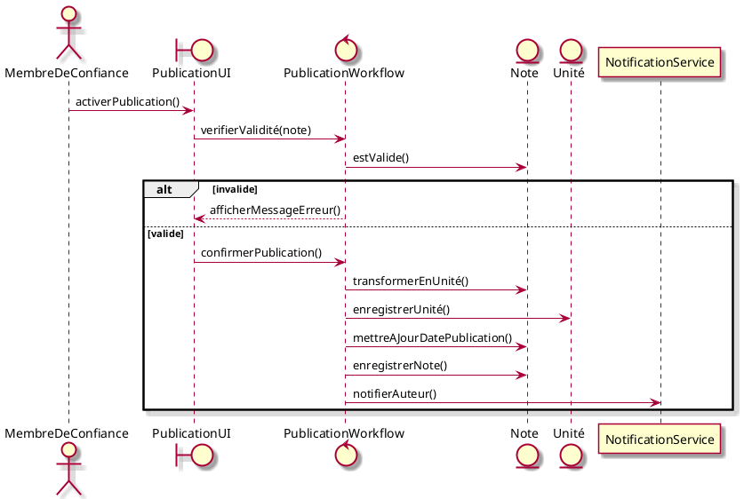

#### Diagramme de classe consolidé

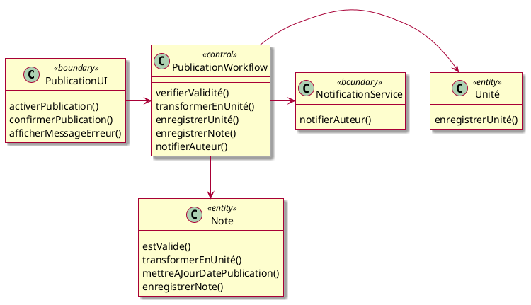

### Extraire les unités d’un compte  

#### **Liste des objets candidats**

À partir du scénario, on identifie les objets suivants :

##### **Acteur**
- `ApplicationMobile` (acteur non humain)

##### **Boundary**
- `ExtraireUnitesAPI` : interface REST permettant à l’application mobile d’interroger le système.

##### **Control**
- `ExtraireUnitesWorkflow` : logique de coordination de la requête (récupération des unités, transformation en format "portable").

##### **Entities**
- `Compte` (identifié par le token JWT)
- `Unité` : objet métier représentant une unité d’apprentissage
- `CompteUnite` : lien entre un compte et ses unités (abonnement)
- `PortableUnit` : représentation "portable" d’une unité à destination de l’application mobile
- `PortableTrack` : version allégée d’une transposition de note (texte, titre, langue…)

##### **Lifecycle**
- `CompteUniteLocator` : composant d’accès aux abonnements
- `UniteLocator` : composant d’accès aux unités à partir de leur ID

#### **Diagramme de séquence – scénario nominal**

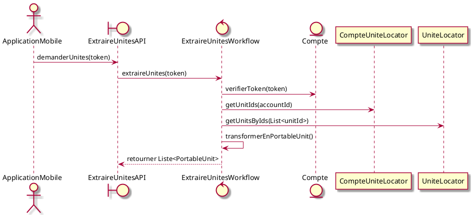

#### **Diagramme de classes consolidé**

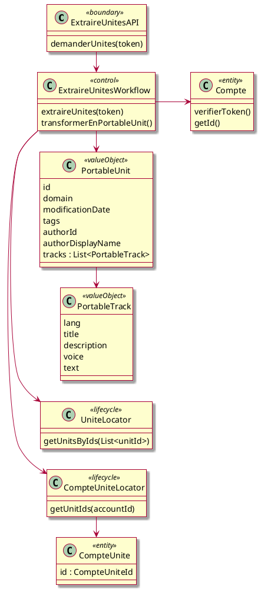

#### **Post-conditions**
- L’application mobile reçoit une **liste JSON de `PortableUnit`**, éventuellement vide.
- Aucun changement d’état n’a lieu côté serveur.

#### **Contraintes non fonctionnelles**
- Les données sont **chiffrées en transit (HTTPS)**.
- La réponse est **structurée et optimisée** pour une application mobile (format `PortableUnit`).

### Faire une remarque

#### Liste des objets candidats

À partir du scénario, on identifie les objets suivants :

- **Acteur** :  
  `ApplicationMobile` *(acteur non humain, déclenche les appels réseau)*

- **Boundary** :  
  `RemarqueAPI` *(interface REST recevant les requêtes avec JWT et contenu)*

- **Control** :  
  `RemarqueWorkflow` *(gestion de la logique métier)*

- **Entities** :  
  - `Remarque` *(contient le message, date, ID d’unité, ID exercice, etc.)*  
  - `Note` *(destination de la remarque)*

- **Lifecycle / Locator** :  
  - `NoteLocator` *(retrouve la note associée à une unité donnée)*

- **Système externe** :  
  `NotificationService` *(envoie un email à l’auteur de la note)*

#### Diagramme de séquence – scénario nominal

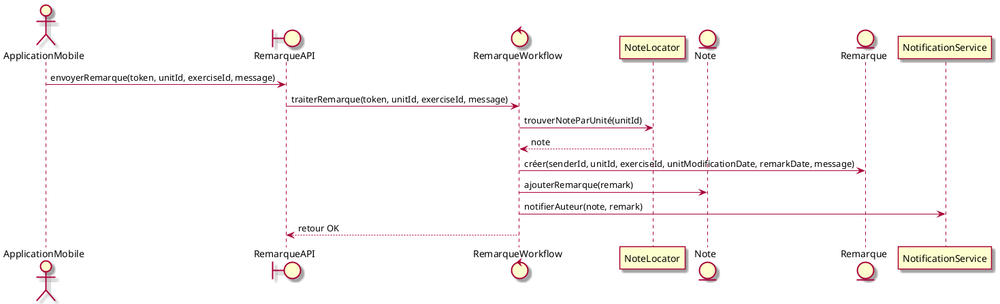

#### Diagramme de classes consolidé

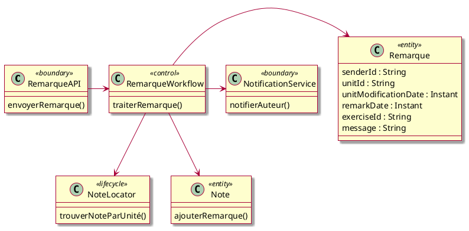

#### Notes d’analyse

- La remarque est **associée à la note**, car c'est durant l'édition de la note qu'elle est utile.
- Le traitement est **asynchrone**, mais ce détail ne concerne pas l’analyse fonctionnelle (voir phase design).
- Le champ `unitModificationDate` permet de signaler si la remarque porte sur une version périmée.
- Le champ `senderId` (22 caractères) désigne le compte à l'origine de la remarque (JWT obligatoire).

### Visualiser une unité

#### Liste des objets candidats

À partir du scénario et des besoins exprimés, on identifie les objets suivants :

- `Visiteur` (acteur)
- `VisualiserUniteUI` (`<<boundary>>`) — interface d’affichage de l’unité
- `VisualiserUniteWorkflow` (`<<control>>`) — coordonne la récupération des données de l’unité
- `Unite` (`<<entity>>`) — unité d’apprentissage
- `UniteLocator` (`<<lifecycle>>`) — récupération par identifiant
- `Auteur` (`<<entity>>`) — compte ayant publié l’unité
- `Abonnement` (`<<entity>>`) — indique si le compte courant est abonné à l’unité
- `Domaine` (`<<value object>>`) — domaine thématique (ex. : Sciences > Management > …)

#### Diagramme de séquence — scénario nominal

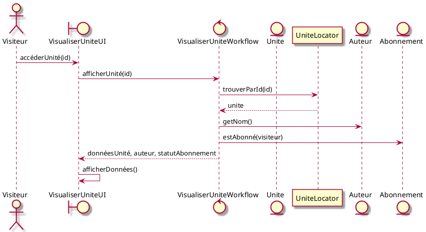

#### Cas alternatifs

##### Unité inexistante

- `UniteLocator` retourne `null`
- `VisualiserUniteUI` redirige vers la recherche, avec un message d’explication :
  *« Cette unité n’existe pas ou n’est plus disponible. »*

#### Diagramme de classes consolidé

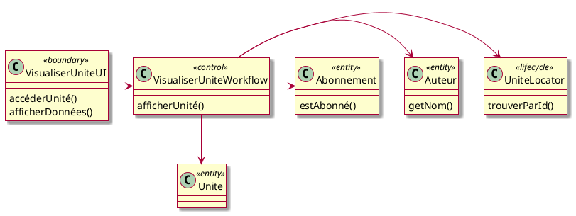

#### Contraintes non fonctionnelles

- Actions contextuelles sécurisées (retirer, s’abonner) visibles uniquement si autorisé

### Analyse du cas d'utilisation "Rechercher des unités"

#### Liste des objets candidats

À partir du scénario, on identifie :

- `Visiteur` (acteur)
- `RechercheUniteUI` (boundary) – interface de saisie et d’affichage des résultats
- `RechercheUniteWorkflow` (control) – logique de traitement des requêtes
- `UniteLocator` (lifecycle) – accès aux unités valides
- `Unité` (entité) – objet métier affiché
- `Compte` (entité) – auteur de l’unité

#### Diagramme de séquence – scénario nominal

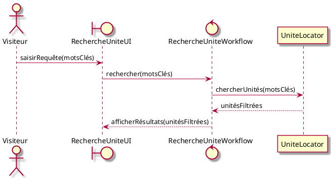

#### Diagramme de séquence – scénario alternatif : aucun résultat

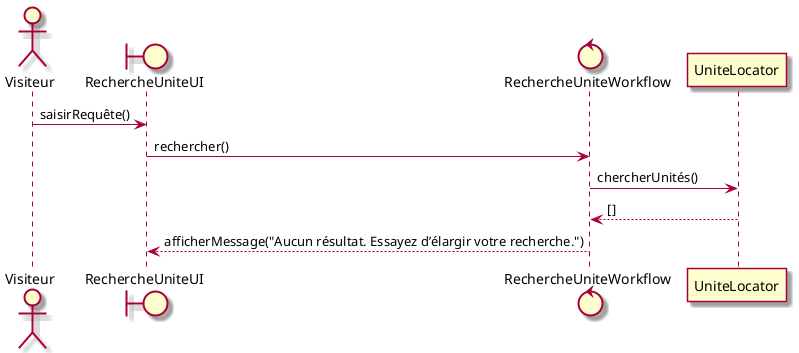

#### Diagramme de classe consolidé

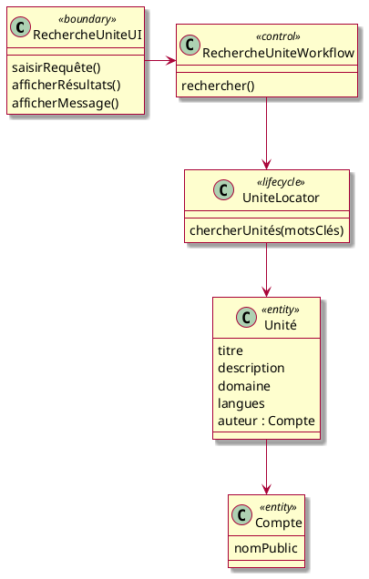

#### Remarques

- La recherche s’effectue avec une **logique d’intersection (ET)** sur les mots-clés présents dans les champs suivants : `titre`, `description`, `domaine`, `tags`, `nom de l’auteur`.
- Le système affiche un message explicite si aucun résultat n’est trouvé, **incitant à réduire les critères**.

## Diagrammes de classes consolidés

### Comptes

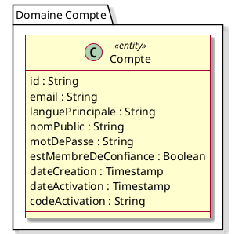

### Notes

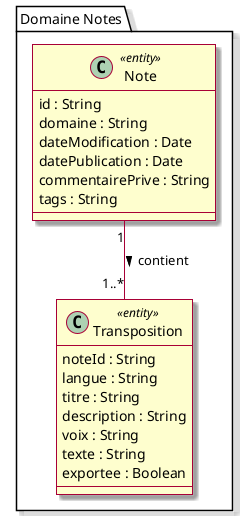

### Unités

```plantuml
@startuml
skin rose

package "Domaine Unités" {

  class Compte <<entity>> {
    id : String
    displayName : String
  }

  class Unite <<entity>> {
    id : String
    domaine : String
    dateModification : Date
    tags : String
    searchVector : tsvector
  }

  class Piste <<entity>> {
    uniteId : String
    langue : String
    titre : String
    description : String
    voix : String
    texte : String
  }


  Compte "1" -- "0..*" Unite : crée >
  Unite "1" -- "1..*" Piste : contient >
  Compte "0..*" -- "0..*" Unite : s'abonne >
}

@enduml

```
