## 3. Architecture

### 3.1. Zonage (inspiré de NSY107)

#### Les zones suivantes sont proposées :

- zone opérationnelle "compte"
- zone opérationnelle "note"
- zone opérationnelle "unité"
- zone gisement de données
- zone référentiel : messages, données et règles partagées
- zone d'échange : API publiques

#### Parti pris : isolation forte entre zones opérationnelles.

Chaque zone opérationnelle défini ses propres entités et dispose de son propre language, sans référence aux autres zones : un nom n'a de sens que dans sa zone et s'il est utilisé ailleurs, cela ne signifie pas forcément la même chose. La redondance apparente qui en résulte est volontaire : elle permet aux zones d'évoluer indépendamment.

Les messages, par contre, sont centralisés et définissent ainsi le contenu des échanges entre zones.

#### Point clairement discutable :

- existance d'un service à cheval sur deux zones (constructeur d'unités). Justifiée pour des raisons techniques. On suppose que ce service sera consommateur en ressources computationnelles et on veut donc garder de la souplesse pour pouvoir le déployer séparément.

### 3.1.1. Zones opérationnelles "compte", "note" et "unité"

La finalité principale de ces zones est de fournir un accès aux données.

### 3.1.2. Zone référentiel

Cette zone contient les éléments référentiels :

- format des messages

- format des données communes (par exemple "domaines" des notes / unités : mathématiques, sciences humaines, ...)

- définition et traitement du MLScript : le langage de description des exercices

### 3.1.2. Zone d'échange (ou d'accès)

Contient :

- une gateway (nginx)
- un micro-frontend pour chaque goupe

Expose les API REST.

### 3.1.2. Zone gisement de données

- trois bases PostgreSQL distinctes (comptes, notes et unités)

### 3.2. Choix des technologies

Dans la mesure où l'application s'adresse au "grand public", on espère que le nombre d'utilisateurs devenienne très élevé (c'est bien le but), nécessitant de hautes performances. Devant ce type de contraintes, une architecture orientée services autour d'un middleware orienté messages a du sens puisqu'elle facilite la scalabilité horizontale. Il en est de même pour la distribution de la base de données.

Le système doit être fiable. Les Middleware Orienté Message améliorent la tolérances à la déconnexion et à la montée en charge, à condition de les utiliser correctement (en traitant les messages en échec par exemple).

L'application doit être sécurisée. Cela implique en particulier :
- chiffrer les mots de passes (avec un sel)
- chiffrer les échanges (HTTPS)
- n'exposer que le nécessaire, filtrer (gateway)
- une stratégie de mots passes (non traité dans le cadre de ce travail)
- une authentification forte (non traité dans le cadre de ce travail)
- la granularité des autorisation

Parcourons les zones opérationnelles :

##### Groupe "compte"

Fonctionnalités : classiques de gestion de compte, via une IHM simple.

Technologies : Spring MCV avec thymeleaf serait un bon candidat.

##### Groupe "unité"

Fonctionnalités : les unités sont principalement destinées à être rechechées, ajoutées / supprimées. L'IHM est assez simple.

Contraintes : une partie de ces fonctionnalités devra être développée pour Android, une autre accessible via le WEB.

Technologies : afin de pouvoir partager du code entre l'interface WEB et Android, là encore on pourrait utiliser un site Spring MVC, le catalogue étant affiché sur Android par le biais d'un composant "navigateur" à l'intérieur de l'application. Un tel composant pourrait interragir avec Android par le biais d'une API exposée par ce dernier dans le navigateur WEB inclus (WebView).

##### Groupe "notes"

Fonctionnalités : gérer les notes (qui sont des textes riches dans un format spécifique) nécessite une IHM très complexe.

Contraintes :  Les temps de réponses pour l'utilisateur (feedback de validation par exemple) doivent être courts et l'édition de note ne nécessite pas beaucoup d'interractions avec la base de données (grosso modo, uniquement au moment du chargement et de la sauvegarde).

Spoiler : on a évalué les différentes technologies WEB / Android, et on s'est rendu compte que pour afficher du markdown correctement, en particulier quand il contient des éléments mathématiques, utiliser une technologie différente pour le WEB et Android (exemple : ReactJS / ReactNative) créait une importante complexité en terme de dépendances (moteur de rendu markdown, plugins, configuration). Or, le besoin d'afficher les exercices existe à la fois dans ce groupe et dans le composant qui permet de s'entrainer. On reste donc sur du HTML partout (web et android).

Technologie : une technologie "single page application" semble indispensable dans la mesure où une très grande partie de la logique s'exécute dans le navigateur. ReactJS est maîtrisé et répond à ce besoin.

##### Conclusion

Le backend reposera sur des services REST (un groupe devient un service REST) et un Middleware Orienté Messages. Ces services seront conteneurisés. En attendant que le nombre d'utilisateur augmente, les images seront déployées sur un serveur mutualisé (VPS). On choisit : **Spring/JPA**, **Kafka** (après comparaison avec d'autres MOM), **docker**, **docker-compose**.

Afin d'harmoniser les technologies pour l'IHM : c'est **ReactJS** qui est choisi et non Spring MVC.

Lors d'expériences de prototypage, **PostgreSQL** a été sélectionnée car ce SGBD contient des fonctionnalités d'indexations facilitant la **recherche "plain text"**, ce qui est important pour filtrer les unités du catalogue.

## 4. organisation technique et déploiement

### 4.1 Déploiement

Ce diagramme présente le déploiement préconisé pour la première version. Dans l'idéal, la sauvegarde externe de la base de données est nécessaire, mais elle ne sera pas mise en place dans le cadre de ce travail.

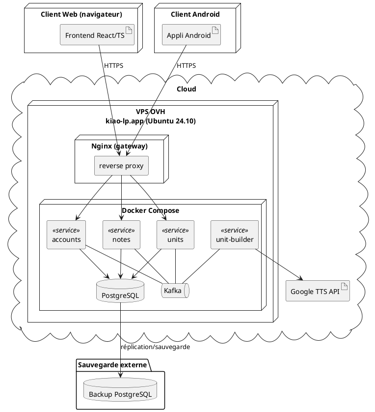

### 4.2 Paquets des microservices opérationnels

Sans aller jusqu'à l'extrême (on autorise les adaptateurs à connaître le coeur), on s'est inspiré de l'architecture hexagonale pour les microservices opérationnels, dont le but principal est de stocker les données : on sépare adaptation (lien vers l'extérieur du système) et coeur (métier et définition des ports). Voici l'organisation qu'on appliquera aux différents cas particuliers :

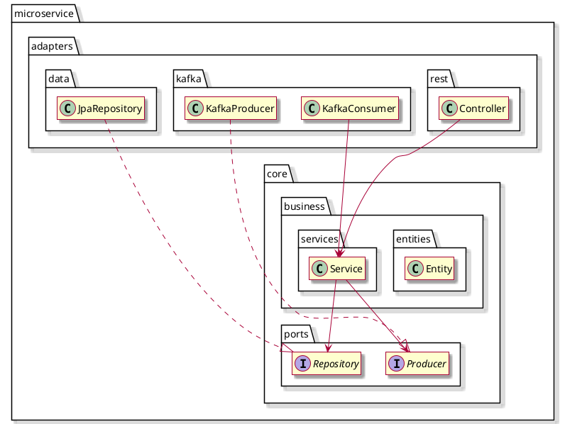

Cependant dans la suite de cette conception, nous ne distinguerons pas les ports des adaptateurs pour éviter une surcharge des diagrammes : nous supposerons implicitement que l'accès du coeur aux adaptateurs se fait par le biais des ports.

### 4.3 Nommage des classes format

Pour faciliter leur distinction et ne pas les confondre avec les entités, on ajoutera "Event", "Command", "Payload" à la fin des noms de classes définissant le format des messages.

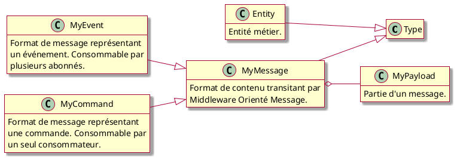

## 5. Cas d'utilisation

Trois cas d'utilisation ont été choisis pour explorer l'architecture applicative :

- Créer un compte : vital et couvre bien la zone "compte".
- Publier une note : risqué et particulièrement atypique.
- Rechercher des unités : bonne couverture de la zone "unité".

### 5.1. Créer un compte

Ce cas d'utilisation implique cinq processus asynchrones et affecte trois zones.

#### 5.1.1. Diagrammes de séquence

##### Processus 1 : initialisation

Interaction entre l'utilisateur et la zone Compte (account).

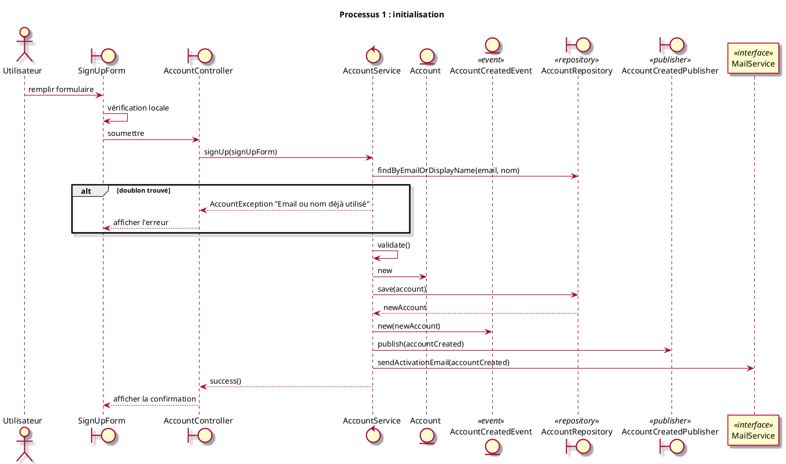

##### Processus 2 : création de la note racine

Le micro-service "note" réagit à la création d'un compte en créant la note racine.

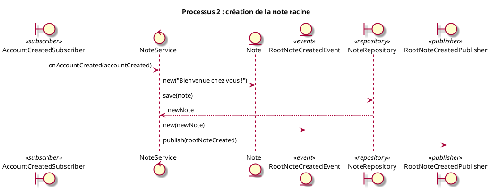

##### Processus 3 : mise à jour de la note dans le compte

Le micro-service compte réagit à la création de la note racine en mettant le compte à jour.

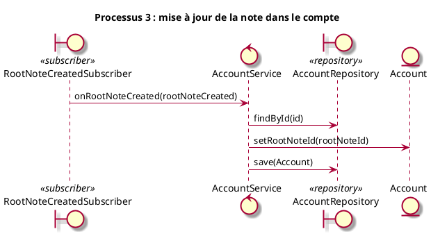

##### Processus 4 : mise à jour du domaine "unité"

Le micro-service unité réagit également à la création du compte, en mettant à jour sa liste d'auteurs.

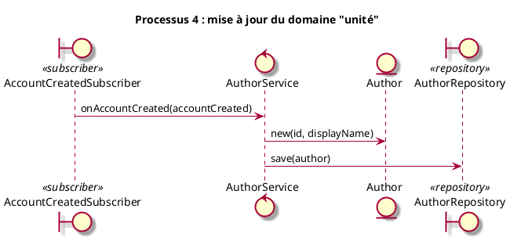

##### Processus 5 : activation du compte

L'utilisateur active le compte (interaction avec la zone "account").

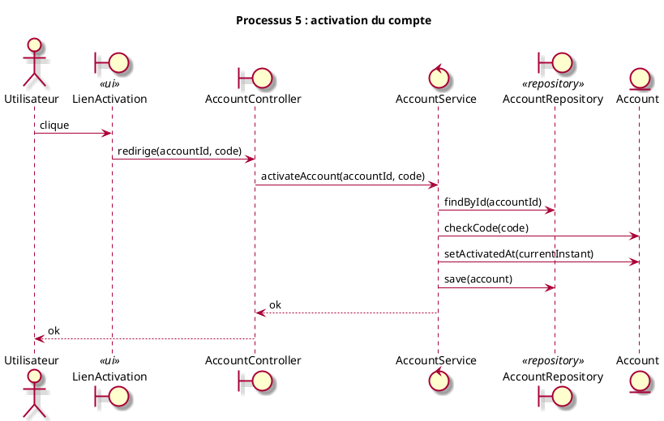

#### 5.1.2. Diagrammes de classes

Le cas d'utilisation défriche une grande partie de la plupart des zones opérationnelles.

##### 5.1.2.1. Zone "account"

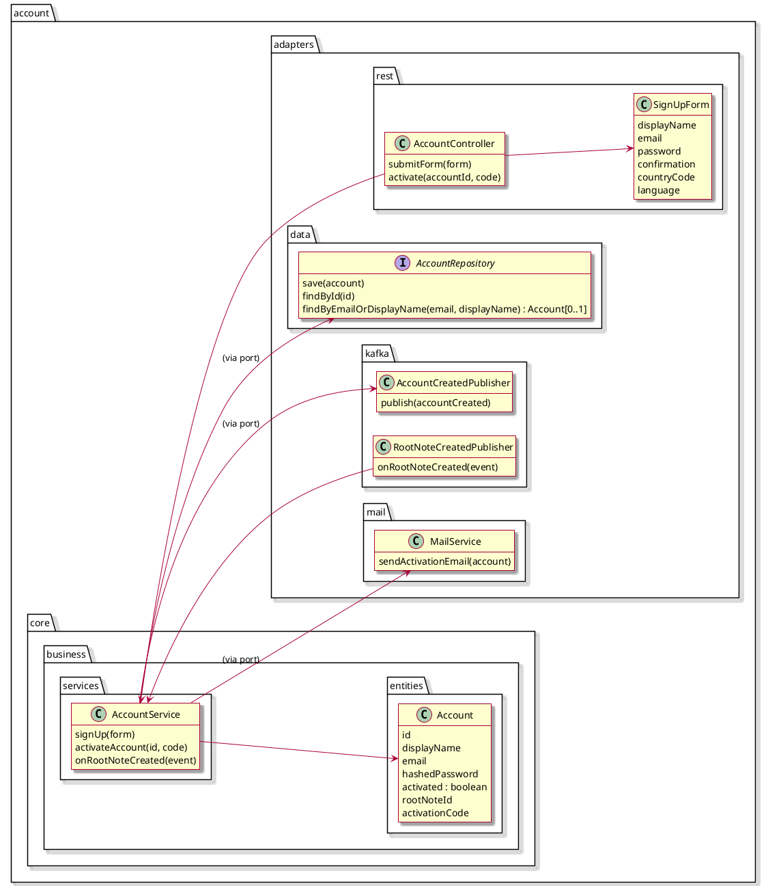

##### 5.1.2.2. Zone "note"

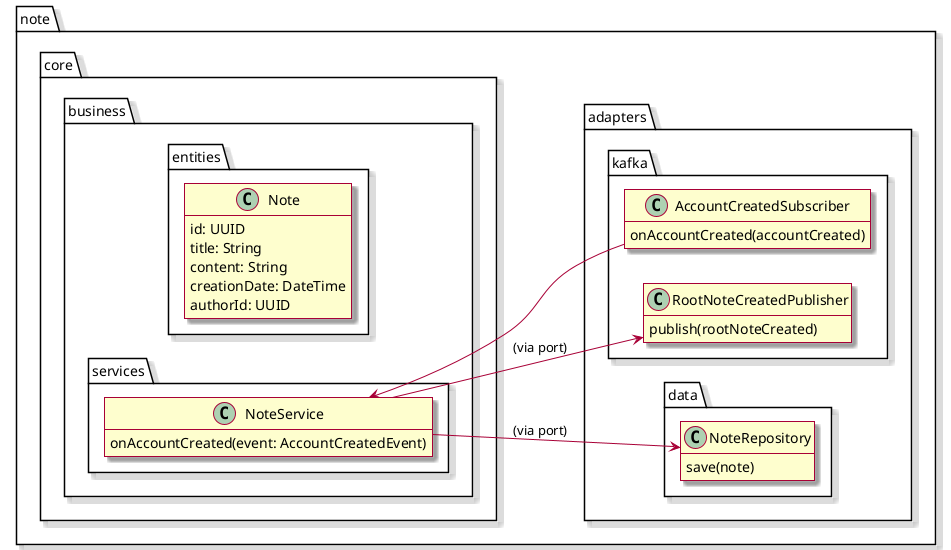

##### 5.1.2.3. Zone "unit"

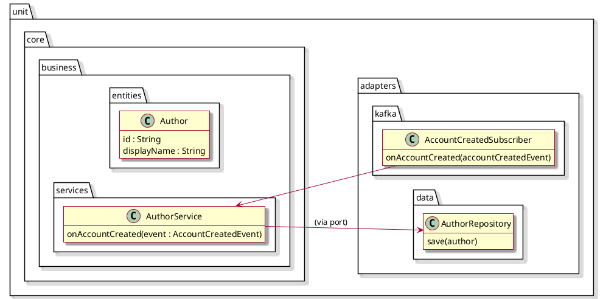


##### 5.1.2.4. Messages

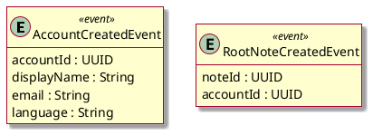

### 5.2. Publier une note

Dans un autre style, mais qui méritait d'être conçu à cause de sa complexité (comprenez "risque"), "publier une note" est en cas d'utilisation plutôt localisé en terme de déploiement et d'impact. On se limitera ici à la construction de l'unité.

#### 5.2.1. Diagramme de séquences

Avant de lire le diagramme de séquence, quelques explications :

- on converti l'audio en .flac car ce format permet le stockage sans perte et pour un volume minimum.
- l'opération appelée "trim" consiste à supprimer les silences en début et fin d'enregistrement car ils varient d'une synthèse à une autre.
- l'interaction avec le système d'exploitation se fait par commandes (principalement "sox").
- après ce processus, le token est porteur de l'information de durée (au tempo normal). Cela évite les accès aux fichiers durant l'exécution de l'application Android, afin de minimiser la latence (perte de temps pour l'utilisateur).

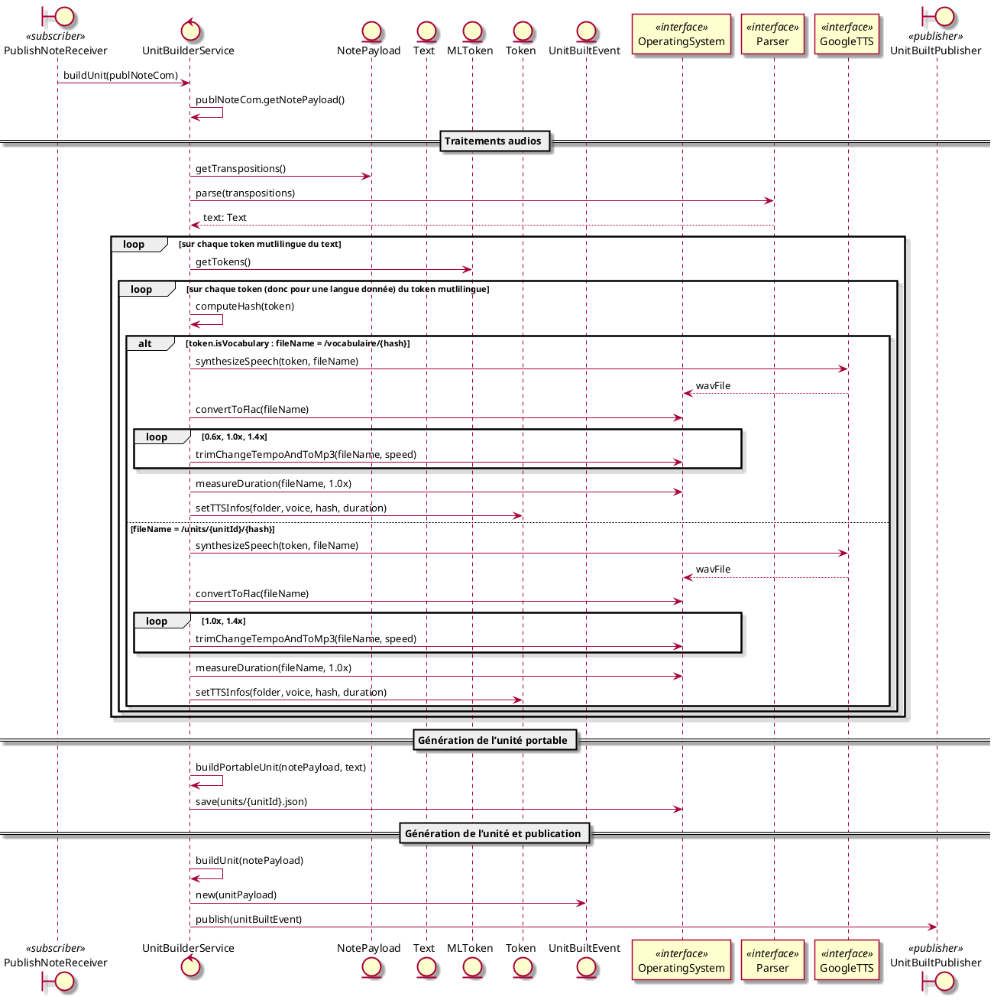

#### 5.2.2. Diagrammes de classes

#### 5.2.2.1. Arbre sémantique 

Inspiré de NFP121 (composite) et NSY102 (lexer, parser). Décrit séparément car modulaire et défini dans une librairie pour réutilisation (en particulier dans l'application Android).

Note pour faciliter la compréhension :

ML signifie MultiLingual. Seule la classe "Token" est spécifique à une langue donnée. Cette structure permet d'alterner les langues d'exercice.

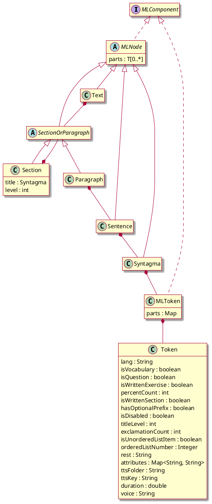

#### 5.2.2.2. Format des fichiers d'unités

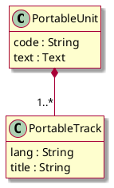

#### 5.2.2.3. Format des messages

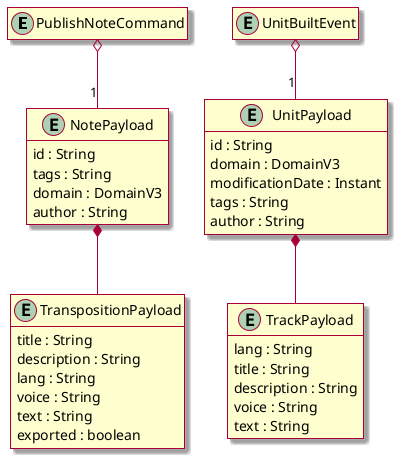

## 5.3. Rechercher des unités

La recherche d’unités se fait en deux étapes distinctes, relevant de domaines séparés :

* **Phase 1 : Authentification** - traitée par le domaine "comptes". Elle est en fait préliminaire à plusieurs cas d'utilisation.
* **Phase 2 : Recherche d’unités** - traitée par le domaine "unités".

---

### 5.3.1. Phase 1 : Authentification

#### 5.3.1.1. Diagramme de séquence

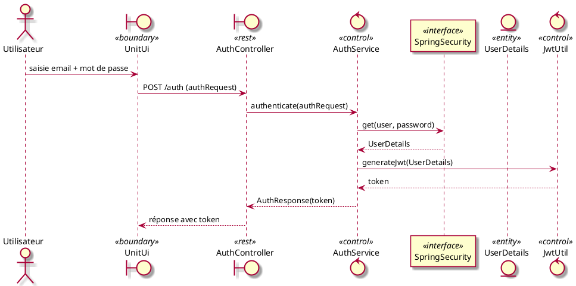

---

#### 5.3.1.2. Diagramme de classes

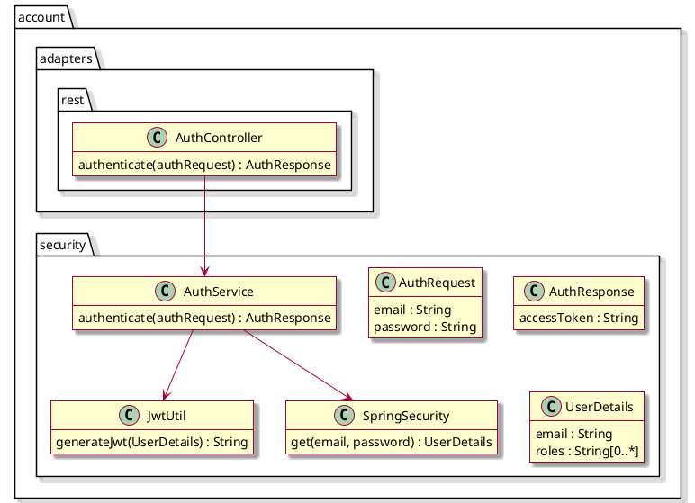

---

### 5.3.2. Phase 2 : Recherche d’unités

Quelques accrobaties à justifier ici : nous souhaitons utiliser la recherche "plain text" de PostgreSQL et pour cela, il est nécessaire de faire une requête native. Conséquence : on ne peut pas lier Unit et Author via JPA. C'est pour cela qu'on obtient d'abord la liste des unités, puis on utilise findAllById pour récupérer tous les auteurs en une seule requête afin de les lier manuellement à leurs unités.

#### 5.3.2.1. Diagramme de séquence

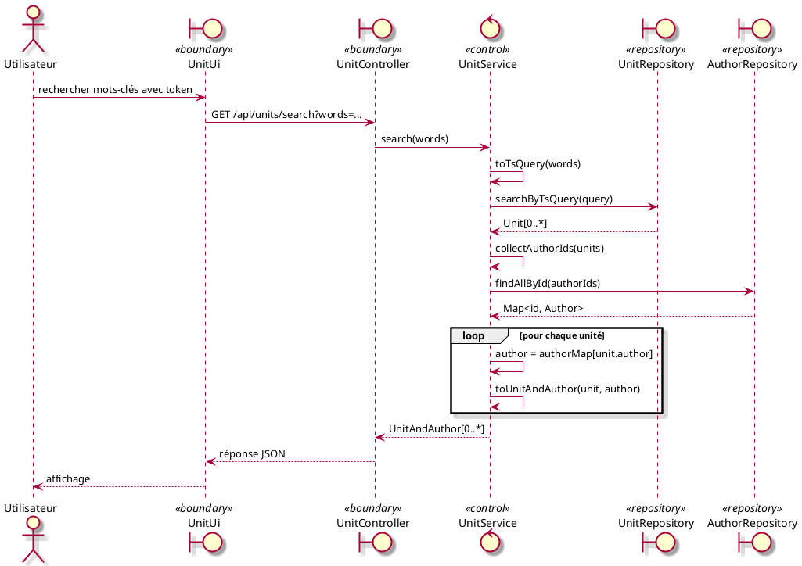

---

#### 5.3.2.2. Diagramme de classes

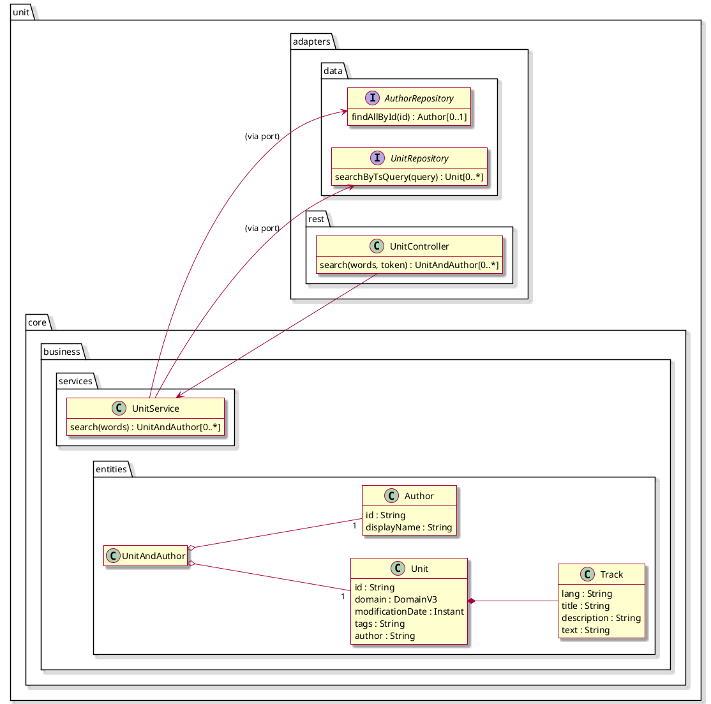

## 6. Diagrammes de classes consolidés

## 6.1. Groupe "account"

```plantuml
@startuml
skin rose
hide empty members
left to right direction

package "account" {

  package adapters.rest {
    class AccountController {
      submitForm(form)
      activate(accountId, code)
    }

    class AuthController {
      authenticate(authRequest) : AuthResponse
    }

    class SignUpForm {
      displayName
      email
      password
      confirmation
      countryCode
      language
    }
  }

  package adapters.data {
    interface AccountRepository {
      save(account)
      findById(id)
      findByEmailOrDisplayName(email, displayName) : Account[0..1]
    }
  }

  package adapters.mail {
    class MailService {
      sendActivationEmail(account)
    }
  }

  package adapters.kafka {
    class AccountCreatedPublisher {
      publish(accountCreated)
    }

    class RootNoteCreatedPublisher {
      onRootNoteCreated(event)
    }
  }

  package security {
    class UserDetails {
      email : String
      roles : String[0..*]
    }

    class AuthService {
      authenticate(authRequest) : AuthResponse
    }

    class JwtUtil {
      generateJwt(UserDetails) : String
    }

    class SpringSecurity {
      get(email, password) : UserDetails
    }
    
    class AuthRequest {
      email : String
      password : String
    }

    class AuthResponse {
      accessToken : String
    }
  }

  package core.business.entities {
    class Account {
      id
      displayName
      email
      hashedPassword
      activated
      rootNoteId
      activationCode
    }
  }

  package core.business.services {
    class AccountService {
      signUp(form)
      activateAccount(id, code)
      onRootNoteCreated(event)
    }
  }

  AccountController --> AccountService
  AccountController --> SignUpForm
  AccountService --> Account
  AccountService --> AccountRepository
  AccountService --> AccountCreatedPublisher
  AccountService --> MailService
  RootNoteCreatedPublisher --> AccountService
  AuthController --> AuthService
  AuthService --> SpringSecurity
  AuthService --> JwtUtil
}

@enduml
```

## 6.2. Groupe "unit"

```plantuml
@startuml
skin rose
hide empty members
left to right direction

package "unit.core.business.services" {
  class UnitService <<control>> {
    search(words) : UnitAndAuthor[0..*]
    linkAccountToUnit(principal, unitId)
    unlinkAccountFromUnit(principal, unitId)
  }

  class AuthorService <<control>> {
    onAccountCreated(accountCreated)
  }
}

package "unit.core.business.entities" {
  class Unit {
    id : String
    domain : DomainV3
    modificationDate : Instant
    tags : String
    author : String
  }

  class Track {
    lang : String
    title : String
    description : String
    text : String
  }

  class Author {
    id : String
    displayName : String
  }

  class UnitAndAuthor {
  }
}

package "unit.adapters.rest" {
  class UnitController {
    search(words, token) : UnitAndAuthor[0..*]
    linkAccountToUnit(principal, unitId)
    unlinkAccountFromUnit(principal, unitId)
  }
}

package "unit.adapters.data" {
  interface UnitRepository <<repository>> {
    searchByTsQuery(query) : Unit[0..*]
  }

  interface AuthorRepository <<repository>> {
    findAllById(id) : Author[0..*]
    save(author)
  }

  interface AuthorUnitRepository <<repository>> {
    deleteById(id)
    save(authorUnit)
  }
}

package "unit.adapters.kafka" {
  class AccountCreatedSubscriber <<subscriber>> {
    onAccountCreated(accountCreated)
  }
}

UnitController --> UnitService
UnitService --> UnitRepository
UnitService --> AuthorRepository
UnitService --> AuthorUnitRepository
AccountCreatedSubscriber --> AuthorService
AuthorService --> AuthorRepository
UnitAndAuthor o-- "1" Unit
UnitAndAuthor o-- "1" Author
Unit *-- Track

@enduml
```

## 6.3. Groupe "note"

```plantuml
@startuml
skin rose
left to right direction
hide empty members

package "note.core.business.entities" {
  class Note {
    id: String
    domain: DomainV3
    modificationDate: Instant
    publicationDate: Instant
    privateComment: String
    tags: String
    author: String
  }

  class Transposition {
    lang: String
    title: String
    description: String
    voice: String
    text: String
    exported: boolean
  }

  Note *-- Transposition
}

package "note.adapters.rest" {
  class NoteController {
    findById(id)
    save(note)
  }
}

package "note.core.business.services" {
  class NoteService {
    onAccountCreated(event)
    findById(id)
    save(note)
  }
}

package "note.adapters.data" {
  class NoteRepository {
    findById(id)
    save(note)
  }
}

package "note.adapters.kafka" {
  class RootNoteCreatedPublisher {
    publish(rootNoteCreated)
  }

  class AccountCreatedSubscriber {
    onAccountCreated(accountCreated)
  }
}

NoteController --> NoteService
AccountCreatedSubscriber --> NoteService
NoteService --> note.adapters.data.NoteRepository
NoteService --> note.adapters.kafka.RootNoteCreatedPublisher
@enduml
```

## 6.4. Messages

```plantuml
@startuml
skin rose
hide empty members
top to bottom direction

class AccountCreatedEvent <<event>> {
  accountId : UUID
  displayName : String
  email : String
  language : String
}

class RootNoteCreatedEvent <<event>> {
  noteId : UUID
  accountId : UUID
}

class UnitBuiltEvent <<event>> {
  unit : UnitPayload
}

class PublishNoteCommand <<command>> {
  note : NotePayload
}

class NotePayload {
  id : String
  tags : String
  domain : DomainV3
  author : String
  transpositions : List<TranspositionPayload>
}

class TranspositionPayload {
  lang : String
  title : String
  description : String
  voice : String
  text : String
  exported : boolean
}

class UnitPayload {
  id : String
  domain : DomainV3
  modificationDate : Instant
  tags : String
  author : String
  tracks : List<TrackPayload>
}

class TrackPayload {
  lang : String
  title : String
  description : String
  voice : String
  text : String
}

PublishNoteCommand o-- "0..1" NotePayload
NotePayload *-- TranspositionPayload
UnitBuiltEvent o-- "0..1" UnitPayload
UnitPayload *-- TrackPayload
@enduml

```

## 6.5. DomainV3 ?

DomainV3 est une "grosse" énumération des domaines, par exemple:

```java
enum DomainV3 {

  COMPUTER_SCIENCES("computer sciences", "informatique", "Informatik", "计算机科学", (DomainV3)null),
  HUMAN_SCIENCES("human_sciences", "sciences humaines", "Sciences humaines", "人文科学", (DomainV3)null),
  ECONOMICS("economics", "économie", "Wirtschaft", "经济学", HUMAN_SCIENCES),
  // ...
  ;


  private final String en;
  private final String fr;
  private final String de;
  private final String zh;
  private final DomainV3 parent;

  private DomainV3(String en, String fr, String de, String zh, DomainV3 parent) {
      this.en = en;
      this.fr = fr;
      this.de = de;
      this.zh = zh;
      this.parent = parent;
  }

}
```

Son avenir est compromis par la détection automatique du sujet par un LLM, bien plus flexible !

## 7. Points de vigilence

Certains points importants n'ont pas été traités, faute de temps pour les analyser en détail, ou parce qu'ils sont hors sujet. En voici une liste indicative.

### Pannes et disponibilité

- quelles sont les exigences en terme de disponibilité ?
- comment sont traitées les indisponibilités de services ou autres problèmes techniques temporaires ?
- combien de fois et à quel interval un message doit il être reprocessé en cas d'échec ?
- que logue-t-on ?
- comment sauvegarder la base de données ? comment la restaurer ? (réplication, backup, ratio perte de données/coût)

### Les scénarios d'exception n'ont pas été évalués

- comment l'utilisateur est-il informé des échecs ?
- quels mécanismes de rattrapage mettre en place (retry, circuit breakers, ...) ?

### Montée en charge

En tenant compte de l'applicatif et de l'infrastructure technique

- comment les besoins en ressources évoluent dans le temps ? exemple : périodes d'examen...
- quel temps de réponse est acceptable pour chaque point terminal ?
- quel est le point de saturation / rupture du système ?

### Confidentialité, RGPD, légalité ...

- les données recueillis sont-elles stockées dans le respect du RGPD ? leur reccueil est-il nécessaire ?
- ne faudrait-il pas informer l'utilisateur et obtenir son consentement pour leur stockage ?
- est-il nécessaire de modérer les publications ?
- la traçabilité est-elle nécessaire, prise en charge et fiable ?
